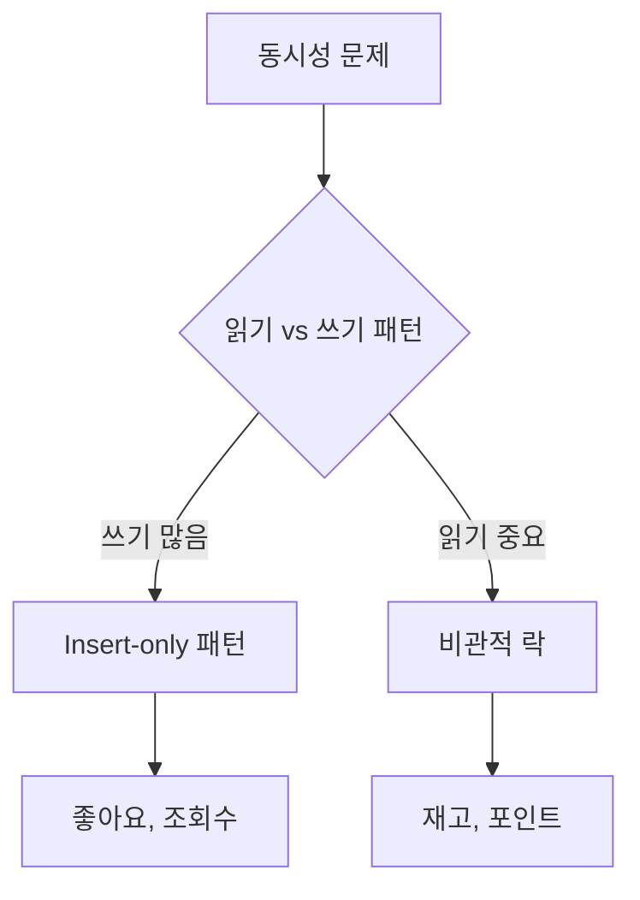

# 글 검토 피드백

## 📌 개요
사용자가 작성한 "DBA는 왜 비관적 락과 유니크 인덱스를 반대했을까?" 글에 대한 검토 결과입니다.

---

## ✅ 자연스러운 부분

1. **서사 구조**: 문제 발견 → 해결 시도 → 반대 → 깨달음 → 정리 → 결론의 흐름이 자연스럽습니다.
2. **구체적 사례**: 주문번호, 좋아요, 재고, 쿠폰, 포인트 등 구체적인 도메인 예시가 잘 들어가 있습니다.
3. **표 활용**: 도메인별 리스크 분석 표가 핵심 내용을 잘 정리하고 있습니다.

---

## ⚠️ 자연스럽지 않거나 개선 가능한 부분

### 1. DBA 반대 이유 설명 부족

**현재 글**:
> "그런데 DBA가 성능과 운영 리스크를 이유로 들며 비관적 락도 거부하고, 유니크 인덱스는 어떻냐는 의견도 반대했다."

**개선 제안**:
DBA의 구체적인 우려사항을 간단히 언급하면 더 설득력이 있습니다.

```markdown
그런데 DBA가 성능과 운영 리스크를 이유로 들며 비관적 락도 거부하고, 유니크 인덱스는 어떻냐는 의견도 반대했다. 
DBA의 주요 우려는 다음과 같았다:
- 비관적 락: 애플리케이션 장애 시 락이 유지되어 DB 전체가 멈출 수 있다는 점
- 유니크 인덱스: 쓰기 성능 저하와 락 경합 가능성
```

**참고 문서**: `.docs/dba-persuasion-criteria.md`의 "DBA의 우려 사항" 섹션 참고

---

### 2. "돈이 걸린 문제" 표현의 단정적 톤

**현재 글**:
> "이건 돈이 걸린 문제니까 비관적 락을 거는게 정답이다"

**개선 제안**:
좀 더 유연한 표현으로 바꾸면 좋습니다.

```markdown
"이건 돈이 걸린 문제니까 비관적 락을 거는게 정답이다"라고 생각했다.
```

→

```markdown
"이건 돈이 걸린 문제니까 비관적 락을 거는게 맞지 않을까?"라고 생각했다.
```

또는

```markdown
"이건 돈이 걸린 문제니까 비관적 락을 거는게 정답이다"라고 당연하게 생각했다.
```

---

### 3. 주문번호 생성 문제 설명 보강

**현재 글**:
> "기존 설계자가 일련번호 발급 과정에 트랜잭션을 적용하면 동시성 문제가 해결된다고 착각해서 발생한 문제였다."

**개선 제안**:
트랜잭션만으로는 해결되지 않는 이유를 간단히 설명하면 더 명확합니다.

```markdown
기존 설계자가 일련번호 발급 과정에 트랜잭션을 적용하면 동시성 문제가 해결된다고 착각해서 발생한 문제였다. 
트랜잭션은 원자성을 보장하지만, 두 트랜잭션이 동시에 같은 값을 읽고 각자 증가시켜 저장하는 Lost Update 문제는 방지하지 못한다.
```

**참고 문서**: `.docs/design/16-design-decision-tradeoffs.md`의 "주문 번호 생성 방식" 섹션 참고

---

### 4. "읽기 vs 쓰기" 트레이드오프 설명 보강

**현재 글**:
> "동시성 문제는 결국 읽기-쓰기 패턴 중 어디에서 병목이 발생하는 것을 감수할 것인가에 대한 선택이라는 점이었다."

**개선 제안**:
좀 더 구체적인 예시를 추가하면 이해가 쉬워집니다.

```markdown
동시성 문제는 결국 읽기-쓰기 패턴 중 어디에서 병목이 발생하는 것을 감수할 것인가에 대한 선택이라는 점이었다.

예를 들어:
- 좋아요: 쓰기가 매우 많지만, 읽기 성능을 포기하고 COUNT(*)로 집계해도 괜찮다면 Insert-only 패턴이 적합
- 재고: 읽기 성능이 중요하고 정확성이 최우선이라면 비관적 락으로 쓰기 병목을 감수
```

**참고 문서**: `.docs/design/12-read-write-tradeoff-reason.md` 참고

---

### 5. 도메인별 전략 설명의 일관성

**현재 글**에서 각 도메인별 전략 설명이 있는데, 일부는 더 구체적으로 설명할 수 있습니다.

**개선 제안**:
- **주문번호 생성**: "Unique 인덱스 + 간단한 충돌 처리" → "Unique 인덱스 + Insert 시도, 중복 시 예외 처리"로 구체화
- **재고 차감**: "비관적 락이나 단일 소비자 기반의 MQ 직렬화" → "비관적 락 (트래픽 낮을 때) 또는 MQ 기반 순차 처리 (Hot Spot 발생 시)"로 상황별 설명

---

## 💻 코드 스니펫 추가 제안

### 1. 주문번호 생성 문제의 잘못된 코드 예시

**추가 위치**: "기존 설계자가 일련번호 발급 과정에 트랜잭션을 적용하면..." 부분 다음

```java
// ❌ 잘못된 예시: 트랜잭션만으로는 Lost Update 방지 불가
@Transactional
public String generateOrderNumber() {
    // 1. 현재 시퀀스 조회
    Long currentSeq = sequenceRepository.getCurrentSequence(); // SELECT seq FROM sequence
    
    // 2. 시퀀스 증가
    Long nextSeq = currentSeq + 1;
    
    // 3. 시퀀스 업데이트
    sequenceRepository.updateSequence(nextSeq); // UPDATE sequence SET seq = ?
    
    return String.format("KES-%s%05d", date, nextSeq);
}
```

**문제점**: 두 트랜잭션이 동시에 같은 `currentSeq`를 읽고 각자 증가시켜 저장하면 Lost Update 발생

---

### 2. 비관적 락 사용 예시 (재고 차감)

**추가 위치**: "재고 차감은 금전적·운영적 피해가 커서 비관적 락이나..." 부분

```java
// ✅ 비관적 락으로 Lost Update 방지
@Transactional
public OrderInfo createOrder(String userId, List<OrderItemCommand> commands) {
    // 비관적 락을 사용하여 상품 조회 (재고 차감 시 동시성 제어)
    // - PK(id) 기반 조회로 Lock 범위 최소화 (Record Lock만 적용)
    // - Lost Update 방지: 동시 주문 시 재고 음수 방지 및 정확한 차감 보장
    Product product = productRepository.findByIdForUpdate(command.productId())
        .orElseThrow(() -> new CoreException(ErrorType.NOT_FOUND,
            String.format("상품을 찾을 수 없습니다. (상품 ID: %d)", command.productId())));
    
    // 락이 걸린 상태에서 재고 차감
    product.decreaseStock(command.quantity());
    productRepository.save(product);
    
    // 트랜잭션 커밋 시 락 해제
}
```

**Repository 메서드**:
```java
@Lock(LockModeType.PESSIMISTIC_WRITE)
@Query("SELECT p FROM Product p WHERE p.id = :productId")
Optional<Product> findByIdForUpdate(@Param("productId") Long productId);
```

**실행되는 SQL**: `SELECT * FROM product WHERE id = ? FOR UPDATE;`

---

### 3. 유니크 인덱스 사용 예시 (좋아요)

**추가 위치**: "좋아요는 폭주하는 쓰기가 본질이므로..." 부분

```java
// ✅ UNIQUE 제약조건으로 중복 방지 (Insert-only 패턴)
@Entity
@Table(
    name = "`like`",
    uniqueConstraints = {
        @UniqueConstraint(
            name = "uk_like_user_product",
            columnNames = {"ref_user_id", "ref_product_id"}
        )
    }
)
public class Like {
    @Column(name = "ref_user_id", nullable = false)
    private Long userId;
    
    @Column(name = "ref_product_id", nullable = false)
    private Long productId;
}

@Transactional
public void addLike(String userId, Long productId) {
    // ⚠️ 주의: 애플리케이션 레벨 체크만으로는 race condition을 완전히 방지할 수 없음
    // 동시에 두 요청이 들어오면 둘 다 "없음"으로 판단 → 둘 다 저장 시도 가능
    Optional<Like> existingLike = likeRepository.findByUserIdAndProductId(user.getId(), productId);
    if (existingLike.isPresent()) {
        return;
    }
    
    // ✅ UNIQUE 제약조건이 최종 보호: DB 레벨에서 중복 삽입을 물리적으로 방지
    Like like = Like.of(user.getId(), productId);
    try {
        likeRepository.save(like);
    } catch (DataIntegrityViolationException e) {
        // UNIQUE 제약조건 위반 예외 처리 (멱등성 보장)
        // 첫 번째만 성공하고 나머지는 예외 발생
        return;
    }
}
```

**핵심**: 애플리케이션 레벨 체크는 최적화용이고, UNIQUE 제약조건이 최종 보호막

---

### 4. 낙관적 락 사용 예시 (쿠폰 사용)

**추가 위치**: "쿠폰은 '중복 발급 = 손실'이라..." 부분

```java
// ✅ 낙관적 락으로 Hot Spot 대응 (쿠폰 사용)
@Entity
@Table(name = "user_coupon")
public class UserCoupon {
    @Version  // 낙관적 락을 위한 버전 컬럼
    @Column(name = "version", nullable = false)
    private Long version;
    
    @Column(name = "is_used", nullable = false)
    private Boolean isUsed;
}

@Transactional
private Integer applyCoupon(Long userId, String couponCode, Integer subtotal) {
    // 낙관적 락을 사용하여 사용자 쿠폰 조회 (동시성 제어)
    // @Version 필드가 있어 자동으로 낙관적 락이 적용됨
    UserCoupon userCoupon = userCouponRepository.findByUserIdAndCouponCodeForUpdate(userId, couponCode)
        .orElseThrow(() -> new CoreException(ErrorType.NOT_FOUND, "쿠폰을 찾을 수 없습니다."));
    
    // 쿠폰 사용 처리
    userCoupon.use();
    
    try {
        // 사용자 쿠폰 저장 (version 체크 자동 수행)
        // 다른 트랜잭션이 먼저 수정했다면 OptimisticLockException 발생
        userCouponRepository.save(userCoupon);
    } catch (ObjectOptimisticLockingFailureException e) {
        // 낙관적 락 충돌: 다른 트랜잭션이 먼저 쿠폰을 사용함
        throw new CoreException(ErrorType.CONFLICT, "쿠폰이 이미 사용되었습니다.");
    }
    
    return discountAmount;
}
```

**핵심**: 
- Hot Spot 발생 시 락 경쟁 없이 병렬 처리 가능
- 충돌 시 한 명만 성공하고 나머지는 예외 발생 (재시도 가능)

---

### 5. 포인트 차감 예시 (비관적 락)

**추가 위치**: "포인트는 실질적으로 현금이라..." 부분

```java
// ✅ 비관적 락으로 포인트 중복 차감 방지
@Transactional
public OrderInfo createOrder(String userId, List<OrderItemCommand> commands) {
    // 비관적 락을 사용하여 사용자 조회 (포인트 차감 시 동시성 제어)
    // - UNIQUE(userId) 인덱스 기반 조회로 Lock 범위 최소화
    User user = userRepository.findByUserIdForUpdate(userId)
        .orElseThrow(() -> new CoreException(ErrorType.NOT_FOUND, "사용자를 찾을 수 없습니다."));
    
    // 락이 걸린 상태에서 포인트 차감
    user.deductPoint(Point.of(totalAmount));
    userRepository.save(user);
    
    // 트랜잭션 커밋 시 락 해제
}
```

**Repository 메서드**:
```java
@Lock(LockModeType.PESSIMISTIC_WRITE)
@Query("SELECT u FROM User u WHERE u.userId = :userId")
Optional<User> findByUserIdForUpdate(@Param("userId") String userId);
```

---

## 📊 보조 자료 제안

### 1. 주문번호 생성 시퀀스 다이어그램 (이미 있음) ✅
현재 글에 포함된 다이어그램이 적절합니다.

### 2. 도메인별 리스크 분석 표 (이미 있음) ✅
현재 글에 포함된 표가 잘 정리되어 있습니다.

### 3. 추가로 고려할 보조 자료

#### A. 읽기/쓰기 트레이드오프 비교 다이어그램



#### B. Hot Spot 발생 시 비관적 락의 한계 시각화

**참고 문서**: `.docs/design/18-hotspot-pessimistic-lock-limitations.md`

```markdown
### Hot Spot 발생 시 비관적 락의 한계

인기 상품에 100명이 동시 주문:
- 비관적 락: 순차 처리 → 10초 소요
- Insert-only: 병렬 처리 → 0.1초 소요
- 차이: 100배 성능 차이
```

#### C. DBA 설득 전략 요약표

**참고 문서**: `.docs/dba-persuasion-criteria.md`

| 설득 포인트 | 비관적 락 | 유니크 인덱스 |
|-----------|----------|-------------|
| 트래픽 패턴 | QPS 낮고 hotspot 없음 | 쓰기 QPS 낮음 |
| 금전적 손실 | 재고 oversell, 포인트 중복 차감 | 쿠폰 중복 발급 |
| 애플리케이션 레벨 한계 | race condition 완전 방지 불가 | race condition 완전 방지 불가 |
| 대안 제시 | 낙관적 락 기본, 제한적 사용 | ON DUPLICATE KEY UPDATE |

---

## 🎯 종합 평가

### 강점
1. ✅ 서사 구조가 자연스럽고 읽기 쉽습니다
2. ✅ 구체적인 도메인 예시가 풍부합니다
3. ✅ 표와 다이어그램을 적절히 활용했습니다
4. ✅ 실무 경험을 바탕으로 한 통찰이 잘 드러납니다

### 개선 제안
1. ⚠️ DBA 반대 이유를 좀 더 구체적으로 설명
2. ⚠️ 주문번호 생성 문제의 기술적 배경 간단히 설명
3. ⚠️ "읽기 vs 쓰기" 트레이드오프에 구체적 예시 추가
4. ⚠️ 일부 표현의 톤 조정 (단정적 → 유연한)

### 보조 자료
1. ✅ 현재 포함된 다이어그램과 표는 적절합니다
2. 💡 Hot Spot 문제 시각화 추가 고려
3. 💡 DBA 설득 전략 요약표 추가 고려

---

## 📚 참고 문서

- `.docs/dba-persuasion-criteria.md`: DBA 설득 전략 및 우려사항
- `.docs/design/12-read-write-tradeoff-reason.md`: 읽기/쓰기 트레이드오프 설명
- `.docs/design/15-concurrency-design-principles.md`: 동시성 처리 설계 원칙
- `.docs/design/18-hotspot-pessimistic-lock-limitations.md`: Hot Spot 문제와 비관적 락 한계
- `.docs/design/16-design-decision-tradeoffs.md`: 주문번호 생성 방식 비교

