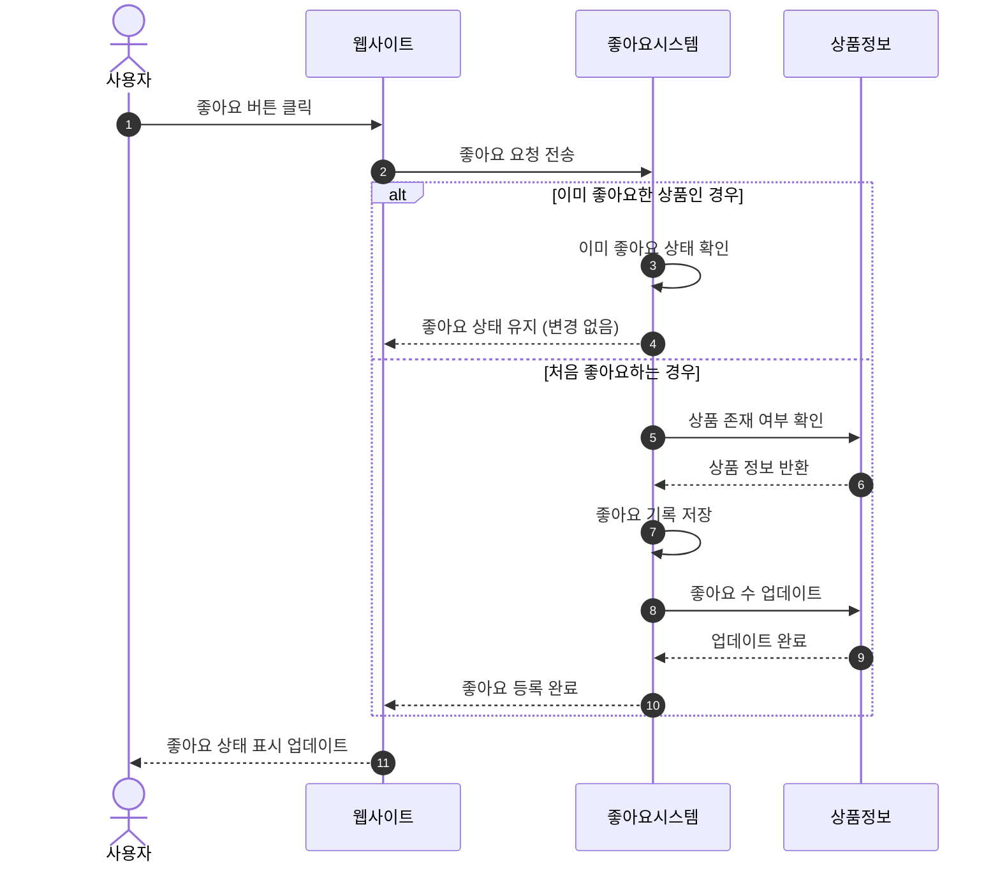
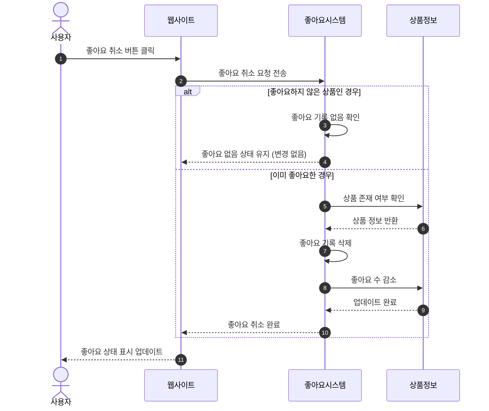
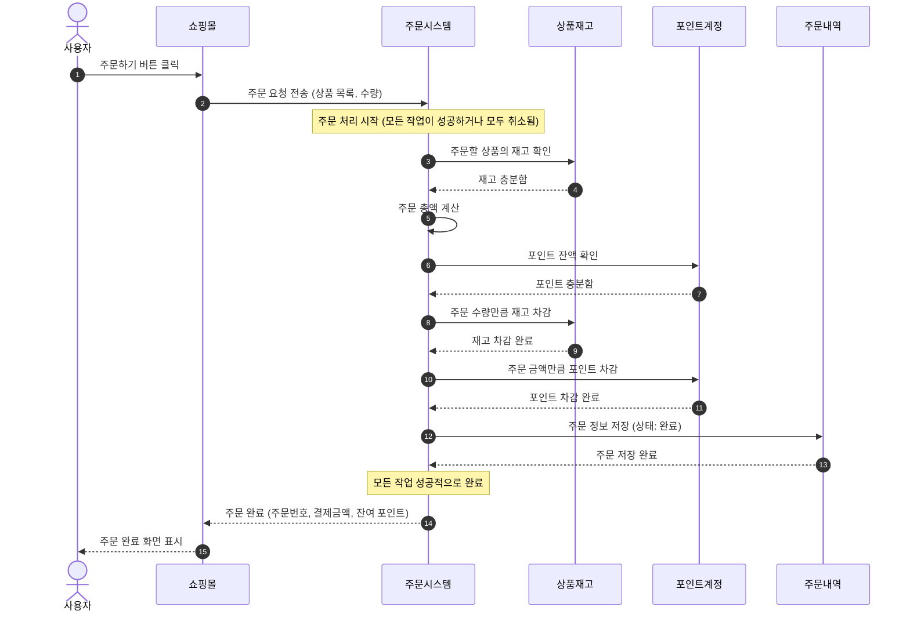
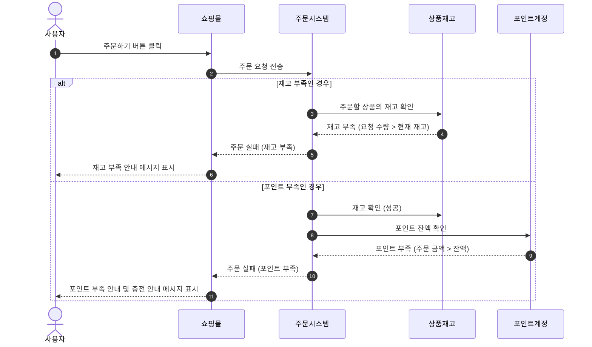

# 02-sequence-diagrams.md
> 루프팩 감성 이커머스 – 시퀀스 다이어그램 명세서  
> (도메인별 행위와 책임 중심 설계)

---

## 🎯 개요
이 문서는 **UC-03 (좋아요)** 와 **UC-04 (주문)** 의 핵심 시나리오를 비즈니스 관점에서 시각화한다.  
기술적인 세부사항보다는 **사용자와 시스템 간의 상호작용 흐름**을 중심으로 설명하여, 비개발자도 쉽게 이해할 수 있도록 작성되었다.

---

## ❤️ UC-03 상품 좋아요 등록/취소

### 1️⃣ 좋아요 등록

**시나리오**: 사용자가 상품에 좋아요를 누르는 과정

**설명**:
- 사용자가 좋아요 버튼을 클릭하면, 시스템은 먼저 해당 사용자가 이미 좋아요를 눌렀는지 확인합니다.
- 이미 좋아요한 경우: 추가 작업 없이 현재 상태를 유지합니다 (중복 방지).
- 처음 좋아요하는 경우: 좋아요 기록을 저장하고 상품의 좋아요 수를 증가시킵니다.

### 2️⃣ 좋아요 취소

**시나리오**: 사용자가 좋아요를 취소하는 과정

**설명**:
- 사용자가 좋아요 취소 버튼을 클릭하면, 시스템은 해당 사용자가 좋아요를 눌렀는지 확인합니다.
- 좋아요하지 않은 경우: 추가 작업 없이 현재 상태를 유지합니다 (중복 방지).
- 좋아요한 경우: 좋아요 기록을 삭제하고 상품의 좋아요 수를 감소시킵니다.

---

## 🛒 UC-04 주문 생성

### 1️⃣ 주문 생성 기본 흐름 (성공 케이스)

**시나리오**: 사용자가 여러 상품을 선택하여 주문을 생성하는 과정

**설명**:
1. 사용자가 주문하기 버튼을 클릭하면, 주문 시스템이 주문 처리를 시작합니다.
2. **재고 확인**: 주문할 상품의 재고가 충분한지 확인합니다.
3. **포인트 확인**: 사용자의 포인트 잔액이 주문 금액보다 충분한지 확인합니다.
4. **재고 차감**: 재고가 충분하면 주문 수량만큼 재고를 차감합니다.
5. **포인트 차감**: 포인트가 충분하면 주문 금액만큼 포인트를 차감합니다.
6. **주문 저장**: 주문 정보를 저장하고 상태를 "완료"로 설정합니다.
7. **결과 반환**: 주문 번호, 결제 금액, 잔여 포인트를 사용자에게 반환합니다.

**중요**: 모든 단계가 성공해야 주문이 완료됩니다. 중간에 실패하면 모든 변경사항이 취소됩니다 (예: 재고 차감 후 포인트 부족 시 재고도 원복).

### 2️⃣ 주문 실패 시나리오

**시나리오**: 재고 부족 또는 포인트 부족으로 주문이 실패하는 경우

**설명**:
- **재고 부족**: 주문하려는 상품의 재고가 부족하면 주문이 실패합니다. 이 경우 아무것도 차감되지 않습니다.
- **포인트 부족**: 포인트 잔액이 주문 금액보다 부족하면 주문이 실패합니다. 재고는 이미 확인했지만, 포인트 부족으로 인해 주문이 취소되므로 재고도 차감되지 않습니다.
