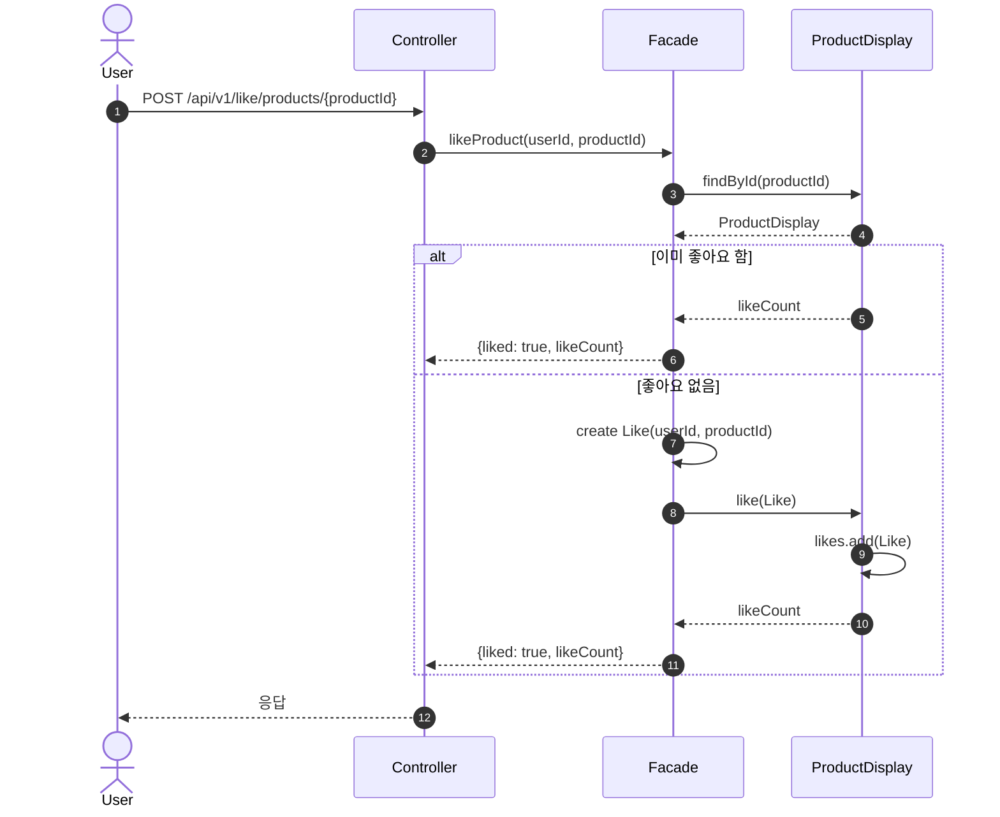
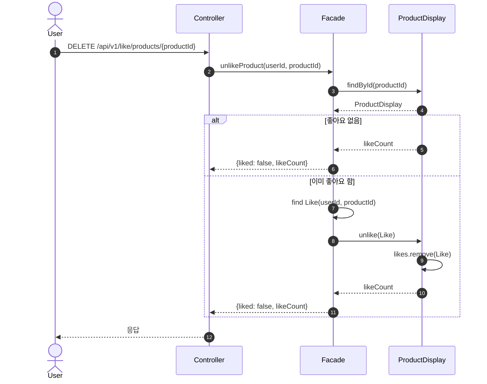
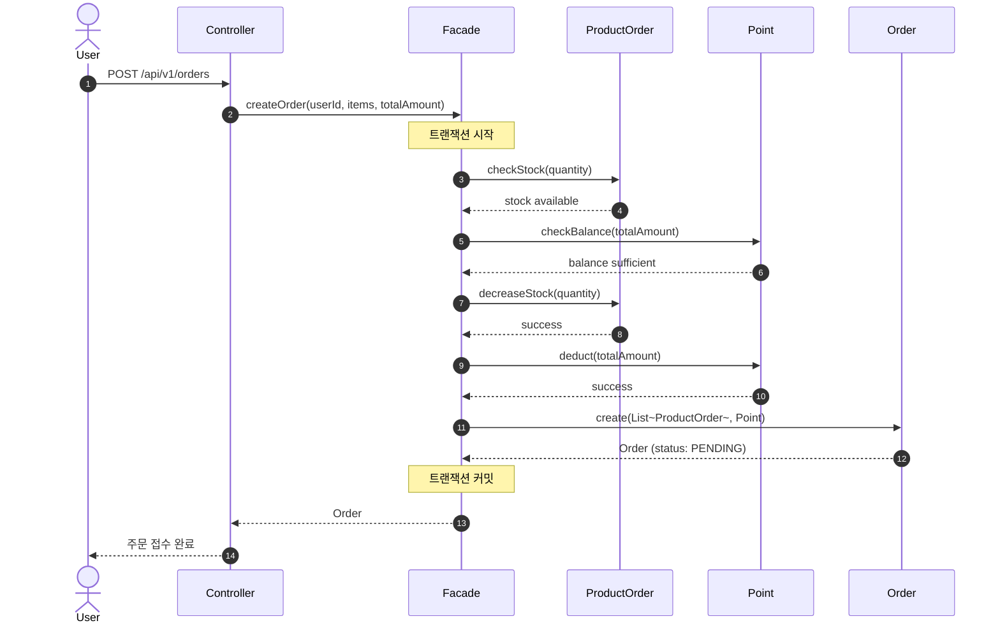
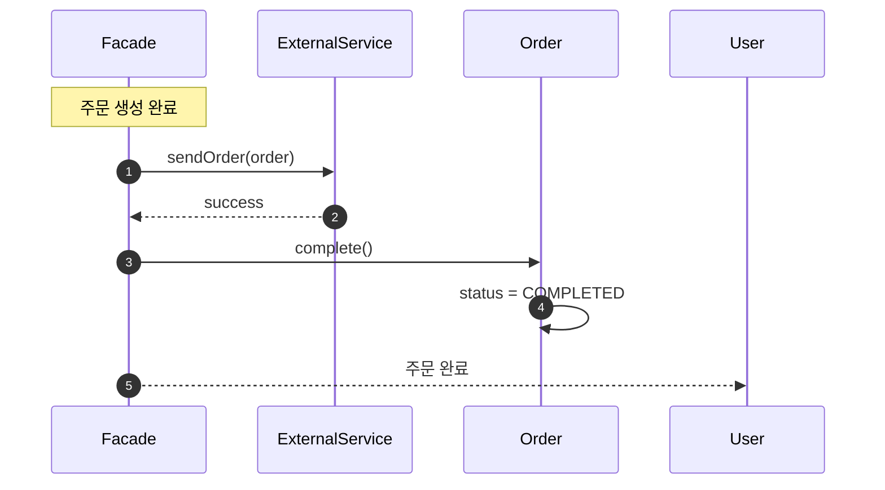
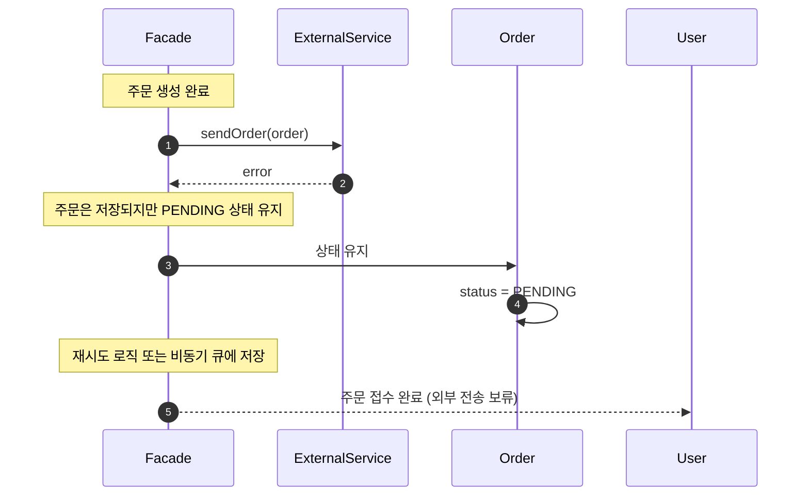

# 02-sequence-diagrams.md
> 루프팩 감성 이커머스 – 시퀀스 다이어그램 명세서  
> (도메인별 행위와 책임 중심 설계)

---

## 🎯 개요
이 문서는 **UC-03 (좋아요)** 와 **UC-04 (주문)** 의 핵심 시나리오를 시퀀스 다이어그램으로 시각화한다.  
핵심 비즈니스 로직 흐름만 표현하여 가독성을 높였다.

---

## ❤️ UC-03 상품 좋아요 등록/취소

> **멱등성 보장**: 이미 좋아요한 상태에서 다시 좋아요 요청 시, 추가 작업 없이 현재 상태(`liked: true`)를 반환하여 멱등성을 보장합니다.

### 1️⃣ 좋아요 등록

### 2️⃣ 좋아요 취소

> **멱등성 보장**: 좋아요하지 않은 상태에서 취소 요청 시, 추가 작업 없이 현재 상태(`liked: false`)를 반환하여 멱등성을 보장합니다.

---

## 🛒 UC-04 주문 생성

### 1️⃣ 주문 생성 기본 흐름

### 2️⃣ 외부 전송 성공

### 3️⃣ 외부 전송 실패 (PENDING 상태 유지)

### 💬 예외 시나리오
- **포인트 부족**: Point.deduct()에서 예외 발생 → 트랜잭션 롤백
- **재고 부족**: ProductOrder.decreaseStock()에서 예외 발생 → 트랜잭션 롤백
- **외부 전송 실패**: 주문은 저장되지만 상태를 PENDING으로 유지하여 재시도 가능
