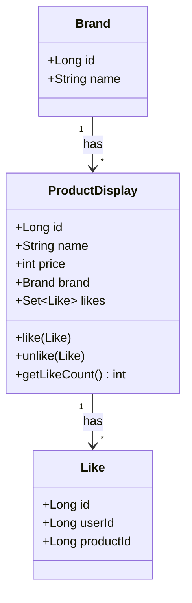
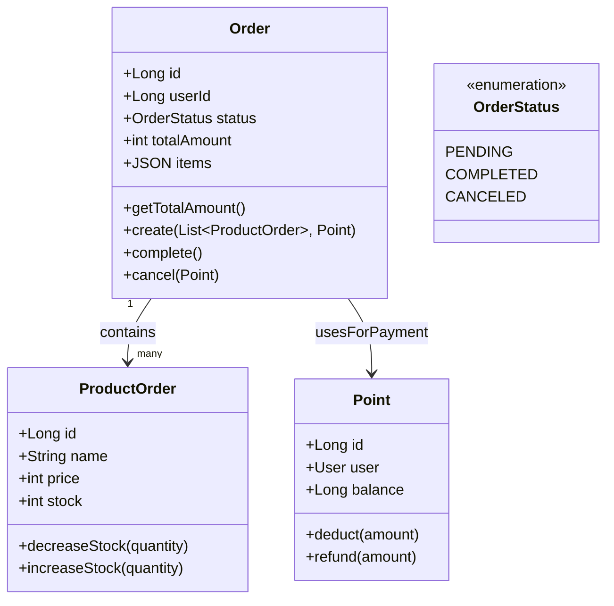
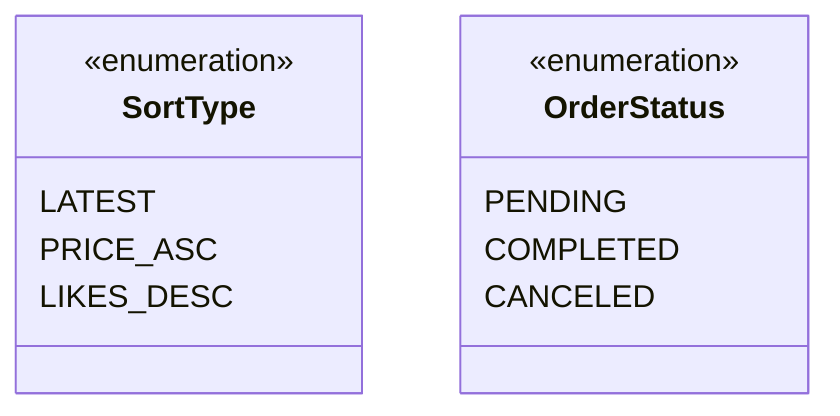

# 03-class-diagram.md
> 루프팩 감성 이커머스 – 클래스 다이어그램 명세서  

---

## 🎯 개요
본 문서는 도메인별 행위에 맞춰 설계된 클래스 다이어그램을 정의한다.  

### 설계 원칙
- **도메인 중심 설계 (DDD)**: 각 도메인이 자신의 책임과 행위를 명확히 가진다
- **도메인 분리**: 동일한 테이블이라도 행위와 책임이 다르면 별도 도메인으로 분리한다
  - 예: `product` 테이블이 하나라도 `ProductDisplay`(표시/조회)와 `ProductOrder`(주문)로 분리
- **행위 중심**: 데이터 구조가 아닌 도메인의 행위와 책임을 우선한다

---

## 🧩 ProductDisplay 도메인 클래스 구조

---

## 📦 클래스 간 역할 설명

| 클래스 | 책임 | 도메인 분리 이유 |
|---------|------|-----------------|
| **Brand** | 브랜드 메타 정보 보유 | 브랜드 정보는 표시와 주문 모두에서 공통으로 사용되지만, 독립적인 도메인으로 관리 |
| **ProductDisplay** | 상품 표시/조회 관련 행위 관리 | 상품의 **표시와 조회**에 집중 (좋아요, 정렬, 목록 조회) |
| **Like** | 상품을 좋아요 표시한 사용자 정보 보유 | 행위의 주체는 상품이지만, 정보를 가지는 주체로서 도메인 분리 |
---

## 🧩 Order 도메인 클래스 구조

---

## 📦 Order 도메인 클래스 간 역할 설명

| 클래스 | 책임 | 도메인 분리 이유 |
|---------|------|-----------------|
| **Order** | 주문의 상태, 총액, 주문 아이템 관리 | 주문 생성, 완료, 취소 등 주문 생명주기 관리. `items`는 `{productId, name, price, quantity}`로 관리 |
| **ProductOrder** | 주문 시 상품 정보 및 재고 관리 | 주문 시점의 상품 정보 보관 및 주문 처리 중 재고 차감/복구 관리 (ProductDisplay와 분리) |
| **Point** | 포인트 잔액 관리 및 결제 처리 | 주문 시 포인트 차감, 취소 시 환불 처리 |
| **User** | 주문자 정보 | 주문과 사용자의 관계 표현 |
| **OrderStatus** | 주문 상태 관리 | 주문의 생명주기 상태 표현 |

---

## 🧭 상태 및 상수 클래스

---

## 🔁 설계 의도 요약

| 설계 포인트 | 선택 근거 |
|--------------|-------------|
| **도메인 중심 (DDD)** | Entity가 스스로 상태를 관리하도록 설계 (ex. ProductDisplay.likeBy(), ProductOrder.increaseStock(), Order.complete()) |
| **도메인 분리** | 동일 테이블이라도 행위와 책임이 다르면 별도 도메인으로 분리. ProductOrder는 주문 처리에 필요한 상품 정보와 재고 관리를 담당하며, ProductDisplay와 분리하여 주문 로직의 독립성 보장 |
| **멱등성 보장** | ProductDisplay의 likedUserIds를 Set으로 관리하여 중복 방지, Order 상태 전이는 멱등하게 처리 |
| **Enum 사용** | SortType, OrderStatus 등 도메인별 상수는 Enum으로 명확히 정의 |

---

## 💡 도메인 분리 상세 설명

### ProductDisplay vs ProductOrder
동일한 `product` 테이블을 사용하더라도, 행위와 책임에 따라 별도 도메인으로 분리:

| 구분 | ProductDisplay | ProductOrder |
|------|----------------|--------------|
| **책임** | 상품 표시, 조회, 좋아요 | 주문 처리 시 상품 정보 및 재고 관리 |
| **주요 행위** | `like()`, `unlike()` | `decreaseStock()`, `increaseStock()` (주문 처리 중 재고 관리) |
| **관심사** | 사용자에게 상품을 보여주는 것 | 주문 생성/취소 시 상품 정보와 재고를 처리하는 것 |
| **변경 빈도** | 상품 정보, 좋아요 수 | 주문 생성/취소 시 재고 변경 |
| **데이터 특성** | 실시간 상품 정보 (조회용) | 주문 처리 중 상품 정보 및 재고 상태 (주문용) |
| **생명주기** | 상품이 존재하는 동안 지속 | 주문 생성 시 생성, 주문 완료/취소 시 처리 |
