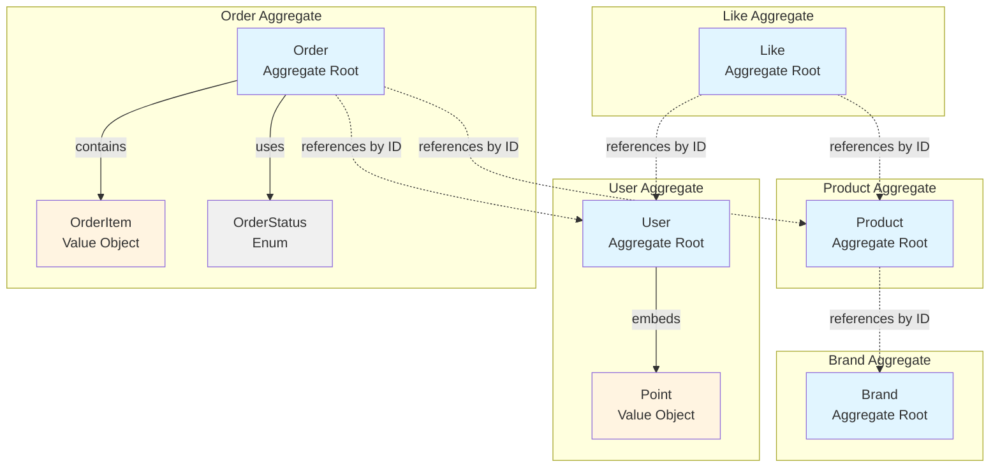
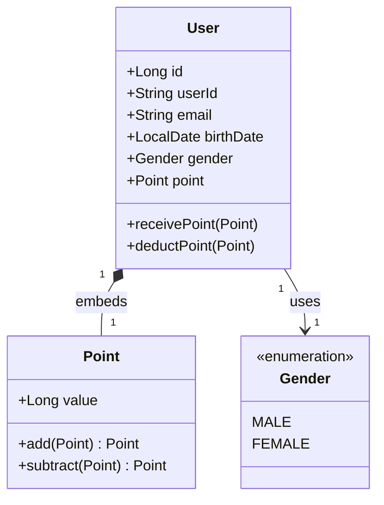
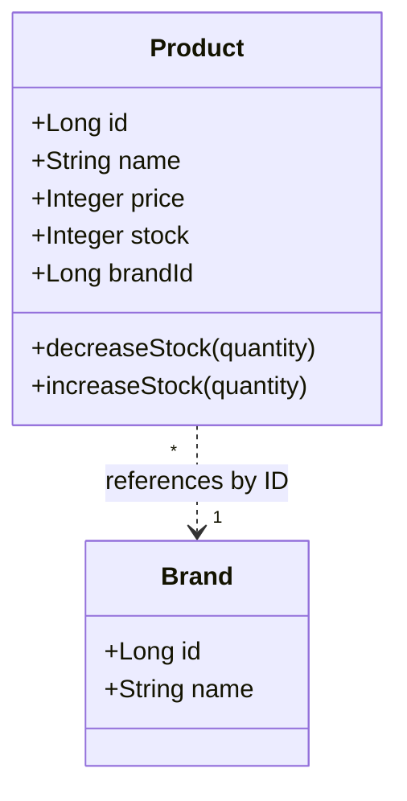
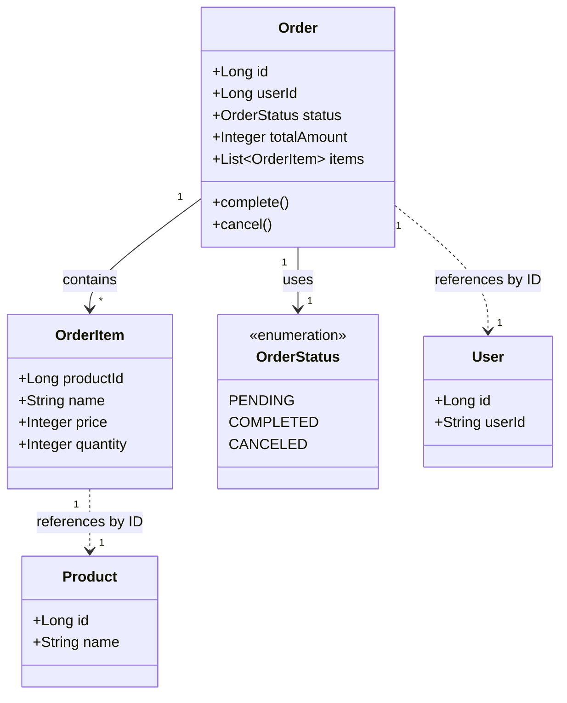
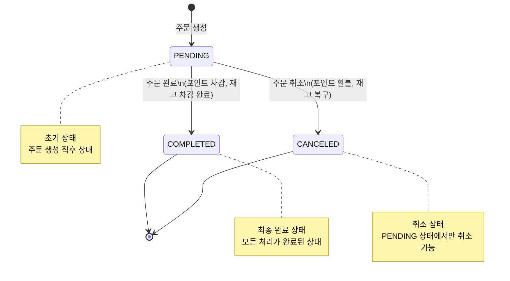
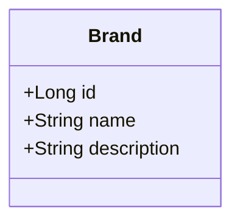
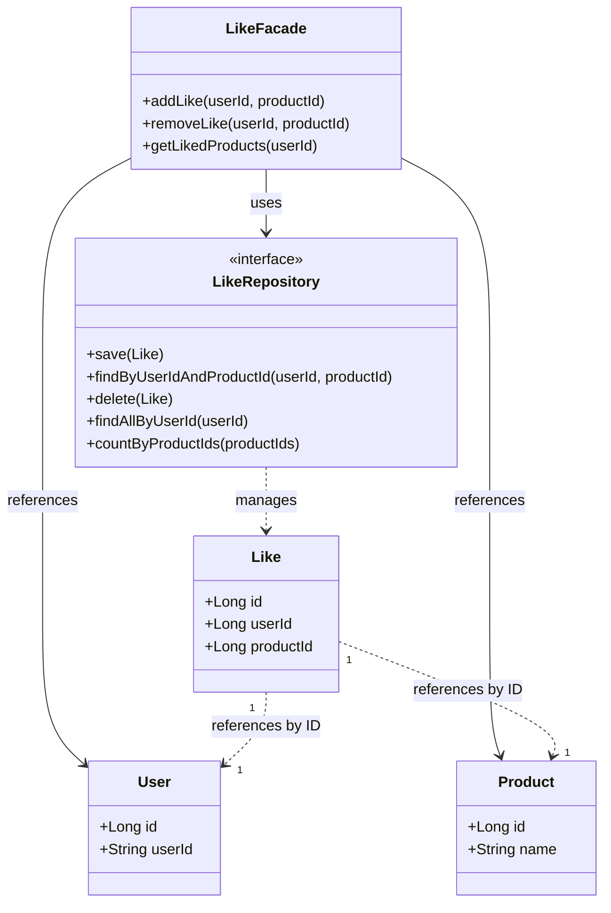
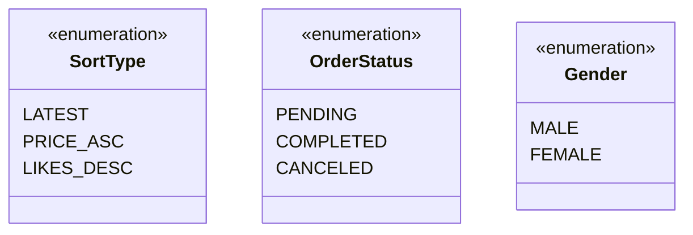

# 03-class-diagram.md
> 루프팩 감성 이커머스 – 클래스 다이어그램 명세서  

---

## 🎯 개요
본 문서는 도메인별 행위에 맞춰 설계된 클래스 다이어그램을 정의한다.  
각 도메인을 독립적인 Aggregate로 분리하여 일관성 경계를 명확히 한다.

### 설계 원칙
- **도메인 중심 설계 (DDD)**: 각 도메인이 자신의 책임과 행위를 명확히 가진다
- **Aggregate 분리**: 각 도메인을 독립적인 Aggregate로 분리하여 일관성 경계를 명확히 한다
  - 예: User, Product, Order, Like, Brand를 각각 독립적인 Aggregate로 구성
- **행위 중심**: 데이터 구조가 아닌 도메인의 행위와 책임을 우선한다
- **Value Object 활용**: 불변 값 객체(OrderItem, Point)를 활용하여 도메인 로직을 캡슐화한다

---

## 📦 Aggregate 구분 다이어그램 (전체 개요)

**Aggregate 경계 설명**:
- 각 Aggregate는 독립적인 일관성 경계를 가집니다.
- Aggregate 간 참조는 ID를 통해서만 이루어집니다 (직접 참조 금지).
- 하나의 트랜잭션은 하나의 Aggregate만 수정해야 합니다.
- 여러 Aggregate 간 협력이 필요한 경우 Application Service (Facade)에서 조율합니다.

---

## 👤 User Aggregate

### 클래스 다이어그램

### 클래스 설명

| 클래스 | 타입 | 책임 |
|---------|------|------|
| **User** | Aggregate Root | 사용자 정보 관리 및 포인트 차감/충전 처리 |
| **Point** | Value Object | 포인트 값과 연산 로직을 캡슐화 (User에 Embedded) |
| **Gender** | Enum | 사용자 성별 정보 |

### 주요 특징
- `Point`는 `User`에 Embedded된 Value Object로, User의 생명주기와 함께 관리됩니다.
- User는 자신의 포인트를 직접 관리합니다 (`receivePoint()`, `deductPoint()`).
- User 생성 시 Point가 함께 초기화됩니다.

---

## 🛍 Product Aggregate

### 클래스 다이어그램

### 클래스 설명

| 클래스 | 타입 | 책임 |
|---------|------|------|
| **Product** | Aggregate Root | 상품 정보 및 재고 관리 (재고 차감/증가 처리) |
| **Brand** | 외부 Aggregate | 브랜드 정보 (Product가 ID로만 참조) |

### 주요 특징
- Product는 Brand를 ID로만 참조하며, Brand는 독립적인 Aggregate입니다.
- 재고 관리 로직을 Product 내부에서 처리합니다 (`decreaseStock()`, `increaseStock()`).
- 주문 처리 시 재고 차감/증가가 발생합니다.

---

## 📦 Order Aggregate

### 클래스 다이어그램

### 클래스 설명

| 클래스 | 타입 | 책임 |
|---------|------|------|
| **Order** | Aggregate Root | 주문의 상태, 총액, 주문 아이템 관리 및 상태 전이 처리 |
| **OrderItem** | Value Object | 주문 시점의 상품 정보 스냅샷 (JSON으로 저장) |
| **OrderStatus** | Enum | 주문의 생명주기 상태 표현 |
| **User** | 외부 Aggregate | 주문자 정보 (Order가 ID로만 참조) |
| **Product** | 외부 Aggregate | 주문된 상품 정보 (OrderItem이 ID로만 참조) |

### 주요 특징
- `OrderItem`은 JSON으로 저장되는 Value Object입니다.
- Order는 User ID와 Product ID를 참조하지만, 실제 Entity를 참조하지 않습니다.
- Order 상태 전이는 Order 내부에서 관리됩니다 (`complete()`, `cancel()`).
- 총액 계산은 Order 생성 시 자동으로 수행됩니다.

### 상태 전이 다이어그램

---

## 🏷 Brand Aggregate

### 클래스 다이어그램

### 클래스 설명

| 클래스 | 타입 | 책임 |
|---------|------|------|
| **Brand** | Aggregate Root | 브랜드 정보 관리 |

### 주요 특징
- Brand는 독립적인 Aggregate입니다.
- Product가 Brand를 참조하지만, Brand는 Product를 알지 못합니다.
- 단순한 정보 관리만 수행합니다.

---

## ❤️ Like Aggregate

### 클래스 다이어그램

### 클래스 설명

| 클래스 | 타입 | 책임 |
|---------|------|------|
| **Like** | Aggregate Root | 사용자와 상품 간의 좋아요 관계를 나타내는 엔티티 |
| **LikeRepository** | Repository Interface | 좋아요 정보의 저장, 조회, 삭제를 담당하는 저장소 인터페이스 |
| **LikeFacade** | Application Service | 좋아요 추가, 삭제, 목록 조회를 처리하는 애플리케이션 서비스 |
| **User** | 외부 Aggregate | 좋아요를 누른 사용자 정보 (Like가 ID로만 참조) |
| **Product** | 외부 Aggregate | 좋아요 대상이 되는 상품 정보 (Like가 ID로만 참조) |

### 주요 특징
- Like는 User와 Product 간의 관계를 나타내는 독립적인 Aggregate입니다.
- User ID와 Product ID만 참조하며, 실제 Entity를 참조하지 않습니다.
- 좋아요 관계의 생명주기를 독립적으로 관리합니다.
- LikeFacade에서 중복 좋아요/취소 요청 시 현재 상태를 반환하여 멱등성을 보장합니다.

---

## 🧭 상수 및 Enum 클래스

### Enum 설명

| Enum | 사용 위치 | 설명 |
|------|-----------|------|
| **SortType** | 상품 목록 조회 | 상품 정렬 기준 (최신순, 가격 오름차순, 좋아요 내림차순) |
| **OrderStatus** | Order Aggregate | 주문 상태 (대기, 완료, 취소) |
| **Gender** | User Aggregate | 사용자 성별 (남성, 여성) |

---

## 🔁 설계 의도 요약

| 설계 포인트 | 선택 근거 |
|--------------|-------------|
| **도메인 중심 (DDD)** | Entity가 스스로 상태를 관리하도록 설계 (ex. Product.decreaseStock(), Order.complete(), User.deductPoint()) |
| **Aggregate 분리** | User, Product, Order, Like, Brand를 독립적인 Aggregate로 분리하여 각각의 일관성 경계를 명확히 함 |
| **멱등성 보장** | LikeFacade에서 중복 좋아요/취소 요청 시 현재 상태를 반환하여 멱등성 보장 |
| **Enum 사용** | SortType, OrderStatus 등 도메인별 상수는 Enum으로 명확히 정의 |
| **Value Object 활용** | OrderItem, Point를 Value Object로 설계하여 불변성과 도메인 로직 캡슐화 |
| **ID 참조 원칙** | Aggregate 간 참조는 ID를 통해서만 이루어지며, 직접 Entity 참조를 금지하여 결합도 감소 |

---

## 📝 Aggregate 간 협력

여러 Aggregate 간 협력이 필요한 경우 Application Service (Facade)에서 조율합니다.

### 예시: 주문 생성 시 협력

- **PurchasingFacade**: Order, User, Product Aggregate 간의 협력을 조정
  - 주문 완료: Order.complete() + User.deductPoint() + Product.decreaseStock()
  - 주문 취소: Order.cancel() + User.receivePoint() + Product.increaseStock()

### 예시: 좋아요 처리 시 협력

- **LikeFacade**: Like, User, Product Aggregate 간의 협력을 조정
  - 좋아요 추가: Like 생성 + User/Product 존재 확인
  - 좋아요 취소: Like 삭제 + User/Product 존재 확인
