# 04-erd.md
> 루프팩 감성 이커머스 – ERD(Entity Relationship Diagram)  

---

## 🎯 개요
본 문서는 클래스 다이어그램을 관계형 데이터베이스 구조로 변환한 ERD를 정의한다.

---

## 🧱 ERD

```mermaid
erDiagram
    USERS {
        bigint id PK
        varchar user_id
        varchar email
        date birthDate
        datetime created_at
        datetime updated_at
        datetime deleted_at
    }

    BRANDS {
        bigint id PK
        varchar name
        varchar description
        datetime created_at
        datetime updated_at
        datetime deleted_at
    }

    PRODUCTS {
        bigint id PK
        varchar name
        int price
        int stock
        bigint ref_brand_id FK
        datetime created_at
        datetime updated_at
        datetime deleted_at
    }

    LIKES {
        bigint id PK
        bigint ref_user_id FK
        bigint ref_product_id FK
        datetime created_at
        datetime updated_at
        datetime deleted_at
    }

    ORDERS {
        bigint id PK
        bigint ref_user_id FK
        int total_amount
        json items "주문 아이템 배열: [{productId, name, price, quantity}]"
        varchar status "OrderStatus enum 값 (PENDING, COMPLETED, CANCELED)"
        datetime created_at
        datetime updated_at
        datetime deleted_at
    }

    POINT {
        bigint id PK
        bigint ref_user_id FK
        bigint balance
        datetime created_at
        datetime updated_at
        datetime deleted_at
    }

    USERS ||--o{ LIKES : "좋아요"
    USERS ||--o{ ORDERS : "주문"
    USERS ||--o{ POINT : "포인트"

    BRANDS ||--o{ PRODUCTS : "브랜드 상품"
    PRODUCTS ||--o{ LIKES : "좋아요 대상"
```

---

## ⚙️ 제약조건
| 테이블 | 제약조건 | 설명 |
|---------|-----------|------|
| **LIKES** | (user_id, product_id) UNIQUE | 동일 사용자-상품 중복 방지 |
| **ORDERS** | status IN ('PENDING', 'COMPLETED', 'CANCELED') | 주문 상태는 OrderStatus enum 값만 허용 |
| **ORDERS** | items JSON 형식: [{productId, name, price, quantity}] | 주문 아이템은 JSON 배열로 저장 |
---
