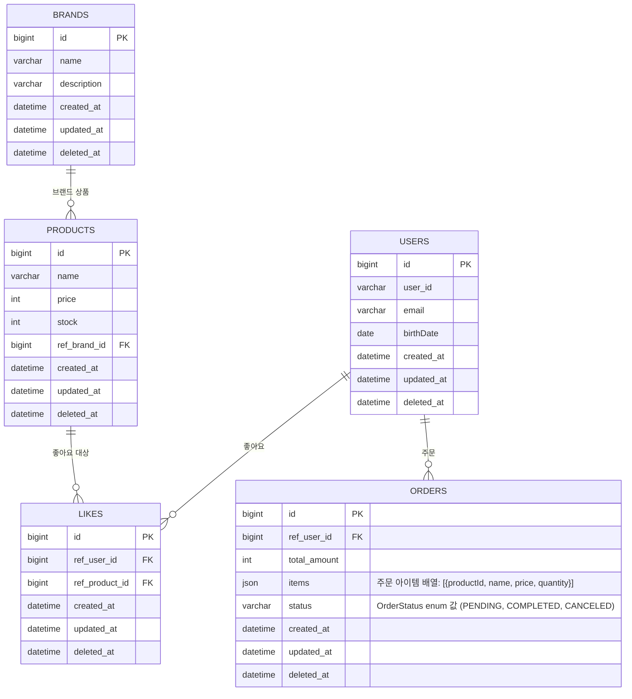

# 04-erd.md
> 루프팩 감성 이커머스 – ERD(Entity Relationship Diagram)  

---

## 🎯 개요
본 문서는 클래스 다이어그램을 관계형 데이터베이스 구조로 변환한 ERD를 정의한다.

---

## 🧱 ERD

---

## ⚙️ 제약조건
| 테이블 | 제약조건 | 설명 |
|---------|-----------|------|
| **LIKES** | (ref_user_id, ref_product_id) UNIQUE | 동일 사용자-상품 중복 방지 |
| **ORDERS** | status IN ('PENDING', 'COMPLETED', 'CANCELED') | 주문 상태는 OrderStatus enum 값만 허용 |
| **ORDERS** | items JSON 형식: [{productId, name, price, quantity}] | 주문 아이템은 JSON 배열로 저장 |
| **USERS** | user_id UNIQUE | 사용자 ID는 고유해야 함 |
| **PRODUCTS** | stock >= 0 | 재고는 0 이상이어야 함 |
| **PRODUCTS** | price >= 0 | 가격은 0 이상이어야 함 |

---

## 📝 데이터베이스 설계 참고사항

### Aggregate 경계
- 각 테이블은 하나의 Aggregate Root에 해당합니다.
- Aggregate 간 참조는 외래키를 통한 ID 참조로만 이루어집니다.
---
