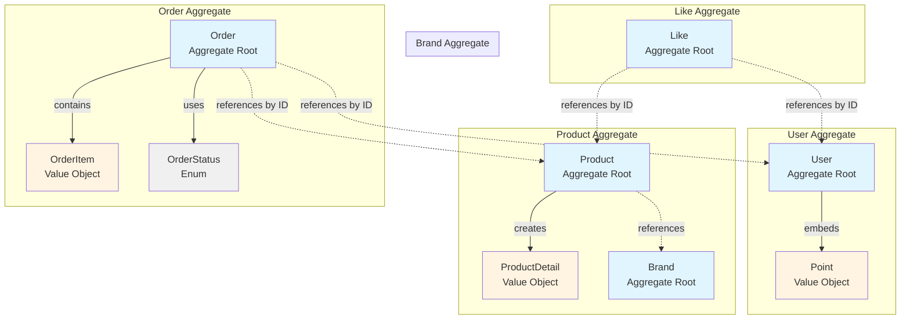
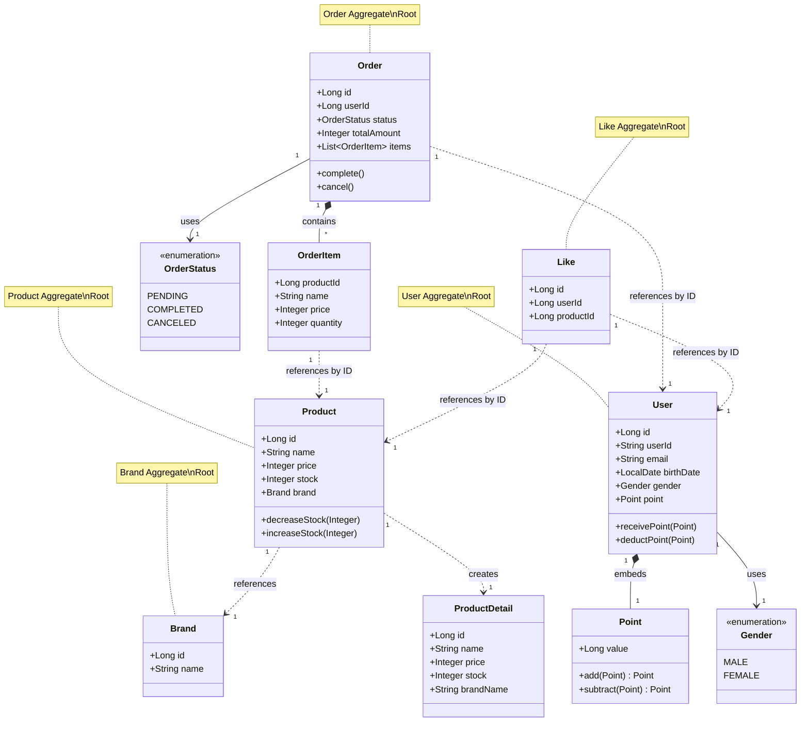
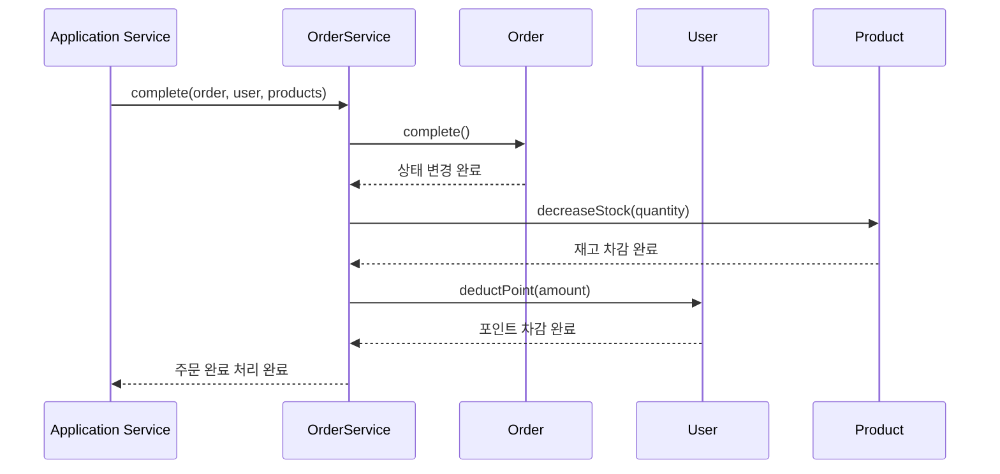

# 06-aggregate-analysis.md
> 도메인 Aggregate 분석

---

## 🎯 개요

본 문서는 프로젝트의 도메인 Aggregate 구조를 분석하고, 각 Aggregate의 경계와 관계를 정의합니다.

### Aggregate 설계 원칙

- **Aggregate Root**: 각 Aggregate는 하나의 Root Entity를 가집니다
- **일관성 경계**: Aggregate 내부의 변경은 트랜잭션 경계 내에서 일관성을 보장합니다
- **참조 규칙**: Aggregate 간 참조는 ID를 통해서만 이루어집니다
- **Value Object**: 불변 값 객체는 Aggregate 내부에 포함됩니다

---

## 📦 Aggregate 구조

### 1. User Aggregate

**Aggregate Root**: `User`

**구성 요소**:
- **Entity**: `User` (Aggregate Root)
- **Value Object**: `Point` (Embedded)
- **Enum**: `Gender`

**특징**:
- `Point`는 `User`에 Embedded된 Value Object로, User의 생명주기와 함께 관리됩니다
- User는 자신의 포인트를 직접 관리합니다 (`receivePoint()`, `deductPoint()`)
- User 생성 시 Point가 함께 초기화됩니다

**Repository**: `UserRepository`

**주요 책임**:
- 사용자 정보 관리 (userId, email, birthDate, gender)
- 포인트 잔액 관리 (충전, 차감)

---

### 2. Product Aggregate

**Aggregate Root**: `Product`

**구성 요소**:
- **Entity**: `Product` (Aggregate Root)
- **Value Object**: `ProductDetail` (조회용 VO)
- **Related Entity**: `Brand` (외부 Aggregate 참조)

**특징**:
- Product는 Brand를 참조하지만, Brand는 독립적인 Aggregate입니다
- 재고 관리 로직을 Product 내부에서 처리합니다 (`decreaseStock()`, `increaseStock()`)
- `ProductDetail`은 Product와 Brand 정보를 조합한 조회용 Value Object입니다

**Repository**: `ProductRepository`

**주요 책임**:
- 상품 정보 관리 (name, price, stock)
- 재고 관리 (차감, 증가)
- Brand 참조 관리

---

### 3. Order Aggregate

**Aggregate Root**: `Order`

**구성 요소**:
- **Entity**: `Order` (Aggregate Root)
- **Value Object**: `OrderItem` (JSON으로 저장)
- **Enum**: `OrderStatus`

**특징**:
- `OrderItem`은 JSON으로 저장되는 Value Object입니다
- Order는 User ID를 참조하지만, User는 외부 Aggregate입니다
- Order 상태 전이는 Order 내부에서 관리됩니다 (`complete()`, `cancel()`)
- 총액 계산은 Order 생성 시 자동으로 수행됩니다

**Repository**: `OrderRepository` (인프라 계층에서 구현)

**주요 책임**:
- 주문 정보 관리 (userId, status, totalAmount)
- 주문 아이템 관리 (JSON 저장)
- 주문 상태 전이 (PENDING → COMPLETED/CANCELED)

---

### 4. Brand Aggregate

**Aggregate Root**: `Brand`

**구성 요소**:
- **Entity**: `Brand` (Aggregate Root)

**특징**:
- Brand는 독립적인 Aggregate입니다
- Product가 Brand를 참조하지만, Brand는 Product를 알지 못합니다
- 단순한 정보 관리만 수행합니다

**Repository**: `BrandRepository` (인프라 계층에서 구현)

**주요 책임**:
- 브랜드 정보 관리 (name)

---

### 5. Like Aggregate

**Aggregate Root**: `Like`

**구성 요소**:
- **Entity**: `Like` (Aggregate Root)

**특징**:
- Like는 User와 Product 간의 관계를 나타내는 독립적인 Aggregate입니다
- User ID와 Product ID만 참조하며, 실제 Entity를 참조하지 않습니다
- 좋아요 관계의 생명주기를 독립적으로 관리합니다

**Repository**: `LikeRepository` (인프라 계층에서 구현)

**주요 책임**:
- 사용자와 상품 간의 좋아요 관계 관리

---

## 🔗 Aggregate 간 관계

### 참조 관계

1. **Order → User**: Order는 User ID를 참조합니다 (외부 Aggregate)
2. **Order → Product**: OrderItem에 Product ID를 포함합니다 (외부 Aggregate)
3. **Product → Brand**: Product는 Brand를 참조합니다 (외부 Aggregate)
4. **Like → User**: Like는 User ID를 참조합니다 (외부 Aggregate)
5. **Like → Product**: Like는 Product ID를 참조합니다 (외부 Aggregate)

### 협력 관계

- **OrderService**: Order, User, Product Aggregate 간의 협력을 조정합니다
  - 주문 완료: Order.complete() + User.deductPoint() + Product.decreaseStock()
  - 주문 취소: Order.cancel() + User.receivePoint() + Product.increaseStock()

---

## 📊 Aggregate 다이어그램

---

## 🎨 상세 Aggregate 다이어그램

---

## 🔄 Aggregate 간 협력 (Domain Service)

---

## 📝 Aggregate 경계 요약

| Aggregate | Root Entity | Value Objects | 외부 참조 | Repository |
|-----------|-------------|---------------|-----------|------------|
| **User** | User | Point | - | UserRepository |
| **Product** | Product | ProductDetail | Brand (ID) | ProductRepository |
| **Order** | Order | OrderItem | User (ID), Product (ID) | OrderRepository |
| **Brand** | Brand | - | - | BrandRepository |
| **Like** | Like | - | User (ID), Product (ID) | LikeRepository |

---

## 💡 설계 의도

### 1. User Aggregate
- **Point를 Embedded로 관리**: Point는 User의 일부이므로 User와 함께 관리됩니다
- **포인트 로직을 User에 위임**: User가 자신의 포인트를 직접 관리합니다

### 2. Product Aggregate
- **Brand를 외부 참조**: Brand는 독립적인 Aggregate이므로 ID로만 참조합니다
- **재고 로직을 Product에 위임**: Product가 자신의 재고를 직접 관리합니다

### 3. Order Aggregate
- **OrderItem을 Value Object로 관리**: 주문 시점의 상품 정보를 불변으로 보관합니다
- **상태 전이를 Order에 위임**: Order가 자신의 상태를 직접 관리합니다

### 4. Brand Aggregate
- **독립적인 Aggregate**: Brand는 Product와 독립적으로 관리됩니다

### 5. Like Aggregate
- **독립적인 Aggregate**: Like는 User와 Product 간의 관계만 관리합니다

---

## ⚠️ 주의사항

1. **Aggregate 간 직접 참조 금지**: Aggregate 간 참조는 ID를 통해서만 이루어집니다
2. **트랜잭션 경계**: 하나의 트랜잭션은 하나의 Aggregate만 수정해야 합니다
3. **일관성 보장**: Aggregate 내부의 일관성은 Aggregate Root를 통해서만 보장됩니다
4. **Domain Service 활용**: 여러 Aggregate 간 협력이 필요한 경우 Domain Service를 사용합니다

