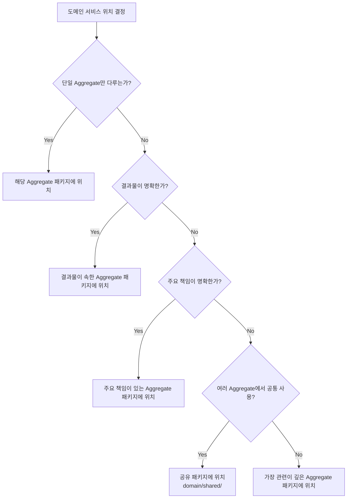

# 07-domain-service-location.md
> 도메인 서비스 위치 결정 원칙

---

## 🎯 개요

본 문서는 DDD에서 도메인 서비스의 위치를 결정하는 원칙과 현재 프로젝트의 적용 방안을 설명합니다.

---

## 📋 도메인 서비스 위치 결정 원칙

### 1. 단일 Aggregate에 속하는 도메인 서비스

**원칙**: 해당 Aggregate의 패키지에 위치

**예시**:
```
domain/
└── user/
    ├── User.java
    ├── UserRepository.java
    └── UserValidationService.java  # User Aggregate만 검증
```

**특징**:
- 하나의 Aggregate 내부 로직만 처리
- 다른 Aggregate를 참조하지 않음

---

### 2. 여러 Aggregate를 조합하는 도메인 서비스

**원칙**: 가장 관련이 깊은 Aggregate의 패키지에 위치

**판단 기준**:
1. **결과물(Output)이 어느 Aggregate에 속하는가?**
2. **주요 책임이 어느 Aggregate에 있는가?**
3. **비즈니스 관점에서 어느 Aggregate의 개념인가?**

**예시 1: 결과물 기준**
```
domain/
└── product/
    ├── Product.java
    ├── ProductDetail.java          # 결과물 (Value Object)
    └── ProductDetailService.java   # ProductDetail을 생성하므로 product 패키지
```

**예시 2: 주요 책임 기준**
```
domain/
└── order/
    ├── Order.java
    └── OrderService.java          # Order, User, Product를 조합하지만
                                    # 주문 완료/취소가 주요 책임이므로 order 패키지
```

---

### 3. 공유 도메인 서비스 (Shared Domain Service)

**원칙**: 별도의 공유 패키지에 위치

**사용 시기**:
- 여러 Aggregate에서 공통으로 사용되는 도메인 로직
- 특정 Aggregate에 속하지 않는 범용 도메인 로직
- 도메인 간 협력이 복잡하고 균형 잡힌 경우

**예시**:
```
domain/
├── shared/
│   └── DiscountCalculator.java    # 여러 Aggregate에서 사용
├── product/
└── order/
```

**주의사항**:
- 남용하지 않도록 주의
- 대부분의 경우 특정 Aggregate 패키지에 위치하는 것이 더 나음

---

## 🔍 현재 프로젝트 분석

### ProductDetailService

**현재 위치**: `domain/product/ProductDetailService.java`

**분석**:
- **입력**: Product (Aggregate), Brand (Aggregate)
- **출력**: ProductDetail (Value Object, product 패키지에 위치)
- **주요 책임**: 상품 상세 정보 조합

**결론**: ✅ **현재 위치가 적절함**

**이유**:
1. 결과물인 `ProductDetail`이 `product` 패키지에 위치
2. 비즈니스 관점에서 "상품 상세 조회"는 Product Aggregate의 책임
3. Brand는 참조만 하고, 주요 로직은 Product 중심

---

### OrderService

**현재 위치**: `domain/order/OrderService.java`

**분석**:
- **입력**: Order, User, Product (3개 Aggregate)
- **출력**: Order 상태 변경, User 포인트 변경, Product 재고 변경
- **주요 책임**: 주문 완료/취소 프로세스

**결론**: ✅ **현재 위치가 적절함**

**이유**:
1. 주문 완료/취소는 Order Aggregate의 핵심 책임
2. User와 Product는 협력자일 뿐, 주체는 Order
3. 비즈니스 관점에서 "주문 처리"는 Order 도메인의 책임

---

## 📊 위치 결정 의사결정 트리



---

## 💡 실무 가이드라인

### ✅ 권장 사항

1. **결과물 기준 우선**: 서비스가 생성하는 결과물이 어디에 속하는지 확인
2. **비즈니스 관점 고려**: 도메인 전문가가 생각하는 "누구의 책임인가?"
3. **일관성 유지**: 프로젝트 전체에서 동일한 원칙 적용

### ⚠️ 주의 사항

1. **공유 패키지 남용 금지**: 대부분의 경우 특정 Aggregate 패키지에 위치하는 것이 더 나음
2. **순환 참조 방지**: Aggregate 간 직접 의존은 피하고, ID 참조 사용
3. **패키지 구조 단순화**: 불필요한 중첩 구조는 피함

---

## 🔄 대안 고려: ProductDetailService 위치

### 옵션 1: 현재 위치 유지 (권장) ✅

```
domain/
└── product/
    ├── Product.java
    ├── ProductDetail.java
    └── ProductDetailService.java
```

**장점**:
- 결과물(ProductDetail)과 같은 패키지
- 비즈니스 관점에서 "상품 상세"는 Product의 책임
- 일관성 유지 (OrderService도 order 패키지에 위치)

**단점**:
- Brand Aggregate를 참조하지만, 이는 정상적인 Aggregate 간 협력

---

### 옵션 2: 공유 패키지로 이동

```
domain/
├── shared/
│   └── ProductDetailService.java
├── product/
└── brand/
```

**장점**:
- Product와 Brand를 동등하게 취급

**단점**:
- 결과물(ProductDetail)과 분리됨
- 공유 패키지 남용
- 비즈니스 관점에서 "상품 상세"는 Product의 책임이 명확함

---

### 옵션 3: 별도 패키지 생성

```
domain/
├── productdetail/
│   ├── ProductDetail.java
│   └── ProductDetailService.java
├── product/
└── brand/
```

**장점**:
- ProductDetail을 독립적인 개념으로 취급

**단점**:
- ProductDetail은 Value Object일 뿐, 독립적인 Aggregate가 아님
- 불필요한 패키지 증가
- Product와의 관계가 약해짐

---

## 📝 결론

### ProductDetailService의 위치

**현재 위치 유지 권장**: `domain/product/ProductDetailService.java`

**이유**:
1. ✅ 결과물인 `ProductDetail`이 `product` 패키지에 위치
2. ✅ 비즈니스 관점에서 "상품 상세 조회"는 Product Aggregate의 책임
3. ✅ 프로젝트의 일관성 유지 (OrderService도 order 패키지에 위치)
4. ✅ 여러 Aggregate를 조합하더라도, 주요 책임이 명확하면 해당 Aggregate 패키지에 위치하는 것이 일반적

---

## 🎓 참고: DDD 원칙

### Eric Evans의 DDD 원칙

> "도메인 서비스는 여러 Aggregate를 조합하는 로직을 처리하지만, 
> 일반적으로 가장 관련이 깊은 Aggregate의 패키지에 위치한다."

### Vaughn Vernon의 구현 패턴

> "도메인 서비스는 결과물이나 주요 책임이 있는 Aggregate의 패키지에 위치한다.
> 공유 패키지는 정말 필요한 경우에만 사용한다."

---

## 📚 참고 자료

- **Domain-Driven Design** (Eric Evans)
- **Implementing Domain-Driven Design** (Vaughn Vernon)
- **Domain-Driven Design Distilled** (Vaughn Vernon)

