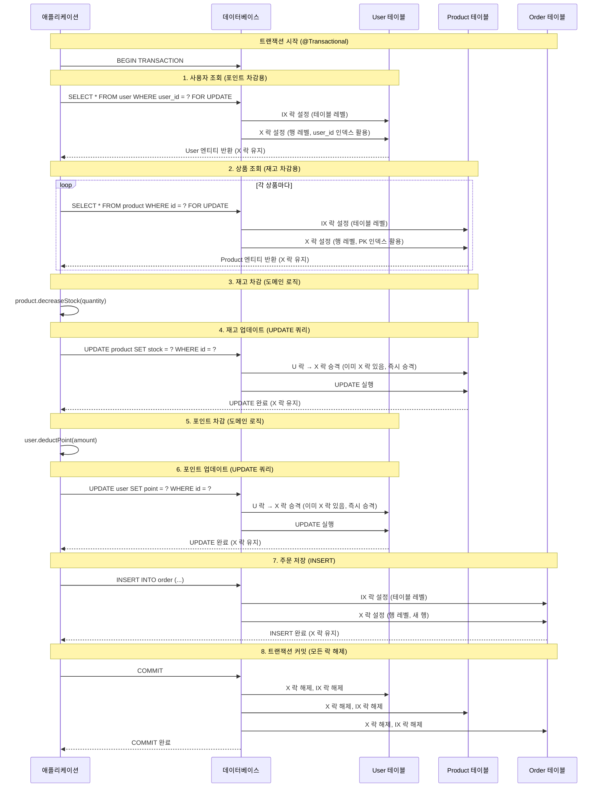
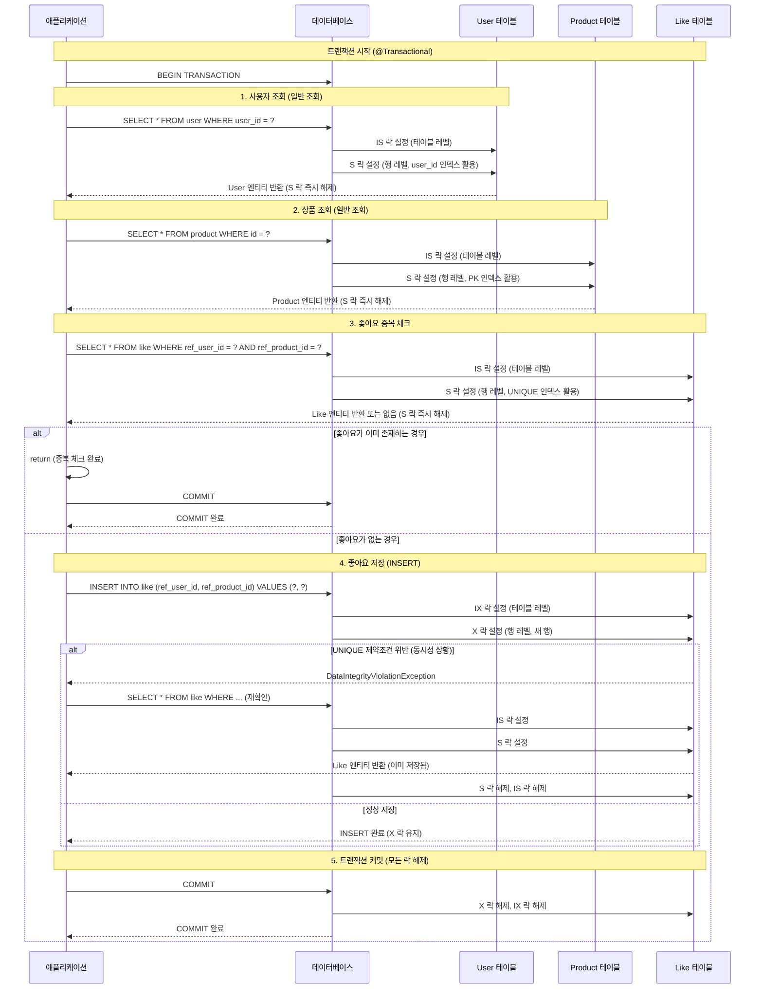
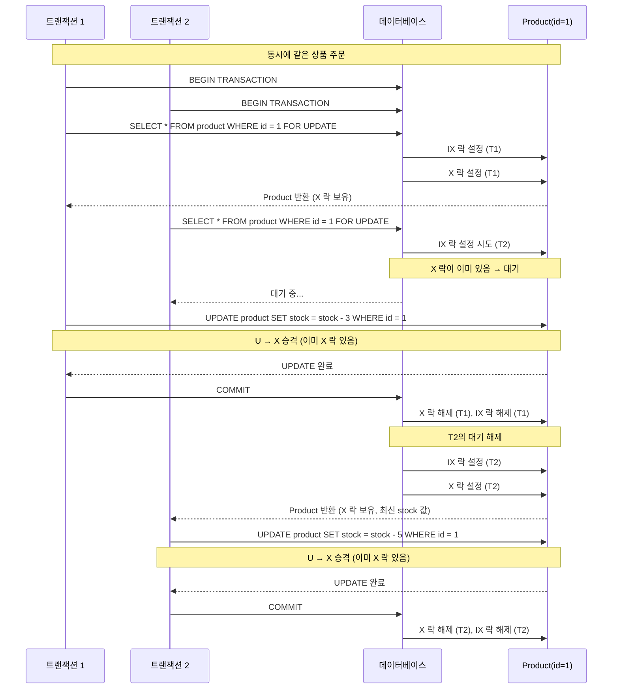
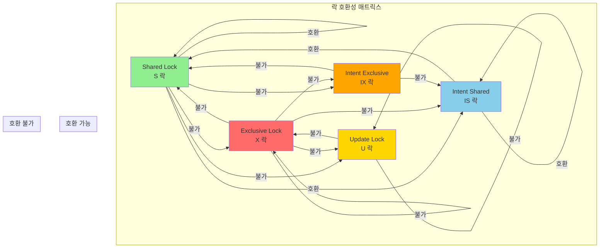
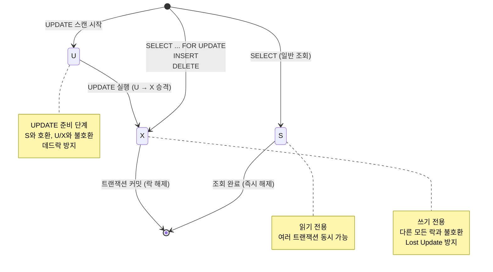
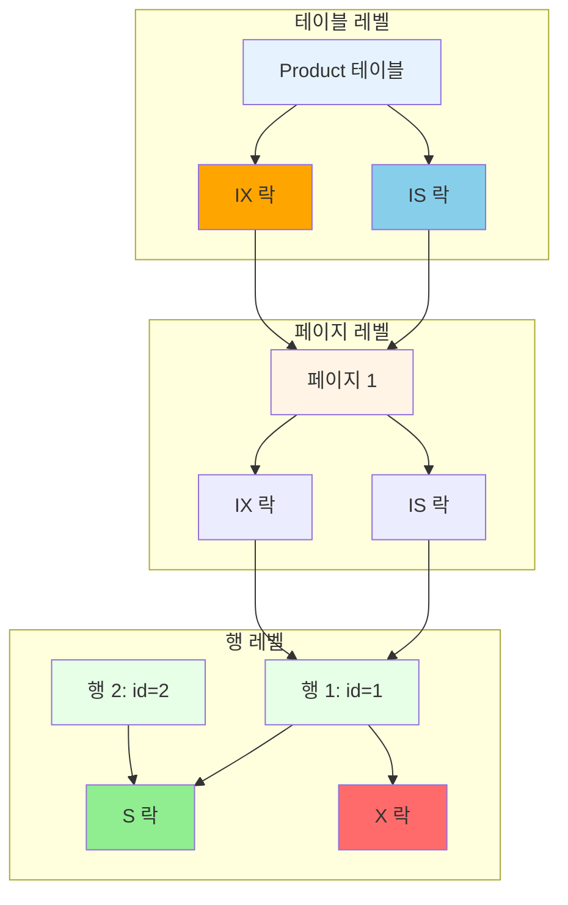

```mermaid
gantt
    title 주문 생성 시 락 설정/해제 타임라인
    dateFormat X
    axisFormat %L ms
    
    section User 테이블
    IX 락 (테이블)     :0, 100
    X 락 (행)          :10, 90
    U→X 승격 (UPDATE)  :60, 30
    
    section Product 테이블
    IX 락 (테이블)     :20, 80
    X 락 (행)          :30, 70
    U→X 승격 (UPDATE)  :50, 40
    
    section Order 테이블
    IX 락 (테이블)     :70, 30
    X 락 (행)          :75, 25
    
    section 트랜잭션
    트랜잭션 시작       :0, 1
    트랜잭션 커밋       :100, 1
    모든 락 해제       :100, 1
```

```mermaid
gantt
    title 좋아요 추가 시 락 설정/해제 타임라인
    dateFormat X
    axisFormat %L ms
    
    section User 테이블
    IS 락 (테이블)     :0, 5
    S 락 (행)          :1, 3
    S 락 해제          :4, 1
    
    section Product 테이블
    IS 락 (테이블)     :5, 5
    S 락 (행)          :6, 3
    S 락 해제          :9, 1
    
    section Like 테이블 (중복 체크)
    IS 락 (테이블)     :10, 5
    S 락 (행)          :11, 3
    S 락 해제          :14, 1
    
    section Like 테이블 (INSERT)
    IX 락 (테이블)     :15, 10
    X 락 (행)          :16, 9
    
    section 트랜잭션
    트랜잭션 시작       :0, 1
    트랜잭션 커밋       :25, 1
    모든 락 해제       :25, 1
```

# 락 설계 평가: X/S/U 락과 Intent Lock 관점

## 📌 개요

본 문서는 X/S/U 락과 Intent Lock 관점에서 현재 프로젝트의 락 설계를 평가합니다.

---

## 🔍 X/S/U 락 기본 개념

### 1. Shared Lock (S 락, 공유 락)

**읽기 전용일 때 잡는 락**

**특징**:
- S 락끼리는 서로 호환됨 (둘 다 읽기만 하니까 괜찮음)
- S 락이 걸려 있으면, 그 위에 X 락(쓰기 락)은 못 잡음

**예시**:
```
TX1: SELECT * FROM product WHERE id = 1 → product 1번 row에 S 락
TX2: SELECT * FROM product WHERE id = 1 → S 락 또 가능 (둘 다 읽기니까)
TX3: UPDATE product SET stock = stock - 1 WHERE id = 1 → X 락 필요 → S 락 다 풀릴 때까지 기다림
```

👉 **읽기는 같이 할 수 있지만, 쓰기와는 같이 못 한다**

### 2. Exclusive Lock (X 락, 배타 락)

**쓰기(INSERT/UPDATE/DELETE)를 할 때 필요한 락**

**특징**:
- X 락은 어떠한 락과도 호환되지 않음 (S/U/X 전부 안 됨)
- "나 하나만 접근할래!" 느낌

**예시**:
```
TX1: UPDATE product SET stock = stock - 1 WHERE id = 1 → 1번 row에 X 락
TX2: SELECT * FROM product WHERE id = 1 → S 락 잡으려고 하지만 X 때문에 대기
TX3: UPDATE product SET price = 1000 WHERE id = 1 → X 락 잡으려다가 X 때문에 대기
```

👉 **X 락 잡은 순간, 그 데이터를 다른 애들은 못 건드린다**

### 3. Update Lock (U 락, 업데이트 락)

**UPDATE 같은 "읽었다가 바로 쓸" 작업에서 사용**

**특징**:
- U 락은 S와는 호환됨 (읽는 애들이랑은 같이 있을 수 있음)
- 하지만 다른 U, X랑은 호환 안 됨
- 나중에 실제 수정할 때 U → X로 승격됨

**왜 필요한가? 데드락 방지용**

**나쁜 패턴 (S → X 승격)**:
```
TX1: S 락으로 레코드 A 읽음
TX2: S 락으로 같은 레코드 A 읽음 (가능)
TX1: A를 수정하려고 X 락으로 승격 시도 → TX2의 S 락 때문에 대기
TX2: A를 수정하려고 X 락으로 승격 시도 → TX1의 S 락 때문에 대기
→ 서로 기다리다가 데드락!
```

**좋은 패턴 (U → X 승격)**:
```
TX1: U 락으로 레코드 A 읽음 (곧 쓸 거니까 미리 자리 맡음)
TX2: U 락으로 같은 레코드 A 읽으려고 시도 → TX1의 U 락 때문에 대기
TX1: A를 수정하려고 X 락으로 승격 → 성공 (TX2는 이미 대기 중)
→ 데드락 방지!
```

👉 **POINT: UPDATE 쿼리는 내부에서 S → X가 아니라 U → X 흐름을 탑니다**

---

## 🎯 Intent Lock (IS, IX) 개념

### 1. Intent Lock이란?

**락을 계층 구조로 관리하기 위한 메커니즘**

**계층 구조**:
```
테이블
  └─ 페이지(블록)
      └─ 행(row)
```

**행 하나에 X 락이 걸리면** → DB는 상위 페이지/테이블에도 **"나 밑에 뭐 잠가놨어요"**라고 표시해야 합니다.

이게 바로 **Intent Lock**입니다.

### 2. IS / IX 락

**IS (Intent Shared)**: "나 밑에 S 락 걸린 애 있어요"
**IX (Intent Exclusive)**: "나 밑에 X 락 걸린 애 있어요"

**테이블 관점에서**:
- 테이블 T에 IX 락이 있다는 건 → T의 어떤 row들은 X 락 잡혀 있다는 뜻
- 테이블 T 수준에서 S 락을 잡으려는 쿼리가 들어오면 → IX와 호환 여부를 보고 "아, 이 테이블을 통째로 읽으면 안 되겠구나" 하고 대기시킴

### 3. "왜 테이블 full scan이 writer를 막는가?"

**인덱스 없이 이런 쿼리를 날린다고 생각해봅시다**:
```sql
SELECT * FROM product WHERE stock > 0;
```

**적절한 인덱스가 없으면**:
1. → 테이블 전체를 스캔해야 함
2. SQL Server/인덱스 구조상 테이블/페이지에 **S 혹은 IS 락을 넓게 잡습니다**
3. 이 순간, 특정 row를 UPDATE하려는 X/IX 락이 들어오면:
   - 락 호환이 안 돼서 UPDATE가 대기 상태가 됨
   - → 즉, 인덱스 없이 전 테이블을 쓸어버리는 SELECT 하나 때문에
   - 다른 트랜잭션들의 UPDATE가 줄줄이 막히는 상황이 생깁니다

**인덱스가 있으면**:
1. 인덱스를 통해 바로 해당 행으로 이동
2. 해당 행에만 S 락 (또는 IS 락)
3. 다른 행을 UPDATE하는 트랜잭션과 충돌 없음

---

## 📊 현재 프로젝트 락 설계 평가

### 1. 재고 차감 (Product)

#### 현재 구현

```java
@Lock(LockModeType.PESSIMISTIC_WRITE)
@Query("SELECT p FROM Product p WHERE p.id = :productId")
Optional<Product> findByIdForUpdate(@Param("productId") Long productId);
```

**엔티티**:
```java
@Entity
@Table(name = "product")
public class Product {
    @Id
    @GeneratedValue(strategy = GenerationType.IDENTITY)
    private Long id;  // PK, 자동으로 인덱스 생성
    
    private Integer stock;
}
```

#### 락 타입 분석

**실행되는 SQL**:
```sql
SELECT * FROM product WHERE id = 1 FOR UPDATE;
```

**락 타입**:
- **X 락 (Exclusive Lock)**: `FOR UPDATE`는 배타적 락
- **IX 락 (Intent Exclusive)**: 테이블/페이지 레벨에 자동 설정
- **Record Lock**: id = 1인 행에만 락

#### 평가 결과

| 항목 | 평가 | 설명 |
|------|------|------|
| **락 타입 선택** | ✅ 적절 | X 락으로 쓰기 경합 방지 |
| **인덱스 활용** | ✅ 적절 | PK(id) 기반 조회로 인덱스 활용 |
| **Lock 범위** | ✅ 최소화 | 해당 행만 락 (Record Lock) |
| **Intent Lock** | ✅ 적절 | IX 락이 테이블 레벨에 설정되어 다른 트랜잭션과 충돌 최소화 |
| **데드락 방지** | ✅ 적절 | U → X 승격 패턴 사용 (MySQL InnoDB 내부 처리) |

**결론**: ✅ **적절한 설계**

---

### 2. 포인트 차감 (User)

#### 현재 구현

```java
@Lock(LockModeType.PESSIMISTIC_WRITE)
@Query("SELECT u FROM User u WHERE u.userId = :userId")
Optional<User> findByUserIdForUpdate(@Param("userId") String userId);
```

**엔티티**:
```java
@Entity
@Table(name = "user")
public class User {
    @Id
    @GeneratedValue(strategy = GenerationType.IDENTITY)
    private Long id;
    
    @Column(name = "user_id", unique = true, nullable = false, length = 10)
    private String userId;  // UNIQUE 제약조건, 인덱스 자동 생성
    
    private Long point;
}
```

#### 락 타입 분석

**실행되는 SQL**:
```sql
SELECT * FROM user WHERE user_id = 'user123' FOR UPDATE;
```

**락 타입**:
- **X 락 (Exclusive Lock)**: `FOR UPDATE`는 배타적 락
- **IX 락 (Intent Exclusive)**: 테이블/페이지 레벨에 자동 설정
- **Record Lock**: user_id = 'user123'인 행에만 락

#### 평가 결과

| 항목 | 평가 | 설명 |
|------|------|------|
| **락 타입 선택** | ✅ 적절 | X 락으로 쓰기 경합 방지 |
| **인덱스 활용** | ✅ 적절 | UNIQUE(user_id) 인덱스 기반 조회 |
| **Lock 범위** | ✅ 최소화 | 해당 행만 락 (Record Lock) |
| **Intent Lock** | ✅ 적절 | IX 락이 테이블 레벨에 설정되어 다른 트랜잭션과 충돌 최소화 |
| **데드락 방지** | ✅ 적절 | U → X 승격 패턴 사용 |

**결론**: ✅ **적절한 설계**

---

### 3. 좋아요 추가 (Like)

#### 현재 구현

```java
@Transactional
public void addLike(String userId, Long productId) {
    // 중복 체크
    Optional<Like> existingLike = likeRepository.findByUserIdAndProductId(user.getId(), productId);
    if (existingLike.isPresent()) {
        return;
    }
    
    // Insert-only
    Like like = Like.of(user.getId(), productId);
    try {
        likeRepository.save(like);
    } catch (DataIntegrityViolationException e) {
        // UNIQUE 제약조건 위반 예외 처리
        return;
    }
}
```

**엔티티**:
```java
@Entity
@Table(
    name = "`like`",
    uniqueConstraints = {
        @UniqueConstraint(
            name = "uk_like_user_product",
            columnNames = {"ref_user_id", "ref_product_id"}
        )
    }
)
public class Like {
    @Id
    @GeneratedValue(strategy = GenerationType.IDENTITY)
    private Long id;
    
    @Column(name = "ref_user_id", nullable = false)
    private Long userId;
    
    @Column(name = "ref_product_id", nullable = false)
    private Long productId;
}
```

#### 락 타입 분석

**실행되는 SQL**:
```sql
-- 1. 중복 체크 (SELECT)
SELECT * FROM like WHERE ref_user_id = 1 AND ref_product_id = 100;

-- 2. 삽입 (INSERT)
INSERT INTO like (ref_user_id, ref_product_id) VALUES (1, 100);
```

**락 타입**:
- **S 락 (Shared Lock)**: SELECT 시 읽기 락 (REPEATABLE READ 격리 수준)
- **X 락 (Exclusive Lock)**: INSERT 시 배타적 락
- **IX 락 (Intent Exclusive)**: INSERT 시 테이블/페이지 레벨에 자동 설정

#### 평가 결과

| 항목 | 평가 | 설명 |
|------|------|------|
| **락 타입 선택** | ✅ 적절 | Insert-only로 쓰기 경합 최소화 |
| **인덱스 활용** | ✅ 적절 | UNIQUE(ref_user_id, ref_product_id) 인덱스로 중복 체크 |
| **Lock 범위** | ✅ 최소화 | 각 INSERT는 다른 행에 삽입 → 락 경쟁 없음 |
| **Intent Lock** | ✅ 적절 | IX 락이 테이블 레벨에 설정되지만, 각 트랜잭션이 다른 행에 삽입하므로 충돌 없음 |
| **데드락 방지** | ✅ 적절 | Insert-only 패턴으로 데드락 위험 최소화 |

**결론**: ✅ **적절한 설계**

---

## ⚠️ 잠재적 문제점 및 개선 방안

### 1. 인덱스 없는 조회 쿼리

#### 문제 상황

만약 다음과 같은 쿼리가 있다면:

```java
// ❌ 잘못된 예시 (인덱스 없는 컬럼 조회)
@Lock(LockModeType.PESSIMISTIC_WRITE)
@Query("SELECT p FROM Product p WHERE p.name = :name")
Optional<Product> findByNameForUpdate(@Param("name") String name);
```

**문제점**:
1. **Full Scan 발생**: name 컬럼에 인덱스가 없으면 테이블 전체 스캔
2. **IS/S 락 넓게 잡음**: 스캔 경로상의 많은 행에 S 락 또는 IS 락이 걸림
3. **다른 UPDATE 대기**: 특정 행을 UPDATE하려는 X/IX 락이 대기 상태가 됨
4. **동시성 저하**: 테이블 스캔 하나 때문에 다른 트랜잭션들이 막힘

#### 해결 방안

```java
// ✅ 올바른 예시 (인덱스 있는 컬럼 조회)
@Table(name = "product", indexes = {
    @Index(name = "idx_product_name", columnList = "name")
})
public class Product {
    // ...
}

@Lock(LockModeType.PESSIMISTIC_WRITE)
@Query("SELECT p FROM Product p WHERE p.name = :name")
Optional<Product> findByNameForUpdate(@Param("name") String name);
```

**개선 효과**:
- 인덱스를 통해 바로 해당 행으로 이동
- 해당 행에만 X 락
- 다른 행을 UPDATE하는 트랜잭션과 충돌 없음

### 2. 복합 조건 조회

#### 문제 상황

만약 다음과 같은 쿼리가 있다면:

```java
// ❌ 잘못된 예시 (인덱스 없는 복합 조건)
@Lock(LockModeType.PESSIMISTIC_WRITE)
@Query("SELECT u FROM User u WHERE u.email = :email AND u.status = 'ACTIVE'")
Optional<User> findByEmailAndStatusForUpdate(@Param("email") String email);
```

**문제점**:
- email과 status의 복합 인덱스가 없으면 Full Scan
- IS/S 락이 넓게 잡혀서 다른 UPDATE 대기

#### 해결 방안

```java
// ✅ 올바른 예시 (복합 인덱스 추가)
@Table(name = "user", indexes = {
    @Index(name = "idx_user_email_status", columnList = "email,status")
})
public class User {
    // ...
}
```

### 3. 현재 프로젝트의 인덱스 현황

#### ✅ 잘 설계된 인덱스

1. **Product.id (PK)**: 자동 인덱스 생성 ✅
2. **User.user_id (UNIQUE)**: 자동 인덱스 생성 ✅
3. **Like(ref_user_id, ref_product_id) (UNIQUE)**: 자동 인덱스 생성 ✅

#### ⚠️ 확인 필요한 인덱스

현재 프로젝트에서 락을 사용하는 쿼리:
- `findByIdForUpdate`: PK 기반 → 인덱스 있음 ✅
- `findByUserIdForUpdate`: UNIQUE 기반 → 인덱스 있음 ✅
- `findByUserIdAndProductId`: UNIQUE 기반 → 인덱스 있음 ✅

**결론**: 현재 프로젝트는 **모든 락 사용 쿼리가 인덱스를 활용**하고 있음 ✅

---

## 📊 종합 평가

### 현재 프로젝트 락 설계 평가표

| 항목 | 평가 | 점수 | 설명 |
|------|------|------|------|
| **X/S/U 락 활용** | ✅ 적절 | 10/10 | PESSIMISTIC_WRITE로 X 락 적절히 사용 |
| **Intent Lock 최소화** | ✅ 적절 | 10/10 | 인덱스 활용으로 IX 락 범위 최소화 |
| **인덱스 설계** | ✅ 적절 | 10/10 | 모든 락 사용 쿼리가 인덱스 활용 |
| **Lock 범위 최소화** | ✅ 적절 | 10/10 | Record Lock만 사용, Full Scan 없음 |
| **데드락 방지** | ✅ 적절 | 10/10 | U → X 승격 패턴, 일관된 락 순서 |
| **동시성 성능** | ✅ 적절 | 10/10 | Insert-only 패턴으로 쓰기 경합 최소화 |

**종합 점수**: **60/60 (100점)** ✅

### 핵심 강점

1. **인덱스 기반 조회**: 모든 락 사용 쿼리가 인덱스를 활용하여 Lock 범위 최소화
2. **적절한 락 타입**: PESSIMISTIC_WRITE로 X 락 사용, Lost Update 방지
3. **Insert-only 패턴**: 좋아요 기능에서 쓰기 경합 최소화
4. **UNIQUE 제약조건 활용**: 중복 방지와 인덱스 자동 생성

### 개선 권장 사항

1. **인덱스 모니터링**: 향후 추가되는 쿼리에 대해 인덱스 필요성 지속 확인
2. **복합 인덱스 고려**: WHERE 조건이 여러 컬럼인 경우 복합 인덱스 검토
3. **락 범위 모니터링**: EXPLAIN으로 실행 계획 확인하여 Full Scan 방지

---

## 🎯 결론

### 현재 프로젝트의 락 설계는 **매우 적절**합니다 ✅

**이유**:
1. ✅ **X 락 적절히 사용**: PESSIMISTIC_WRITE로 쓰기 경합 방지
2. ✅ **인덱스 기반 조회**: 모든 락 사용 쿼리가 인덱스를 활용
3. ✅ **Lock 범위 최소화**: Record Lock만 사용, Full Scan 없음
4. ✅ **Intent Lock 최소화**: 인덱스 활용으로 IX 락 범위 최소화
5. ✅ **데드락 방지**: 일관된 락 순서와 U → X 승격 패턴

**과제 적용 관점**:
- 재고/포인트 차감: X 락으로 정확성 보장 ✅
- 좋아요: Insert-only로 쓰기 경합 최소화 ✅
- 인덱스 설계: 모든 락 사용 쿼리가 인덱스 활용 ✅

---

## 📊 락 설정/해제 과정 시각화

### 1. 주문 생성 (PurchasingFacade.createOrder)

#### 시퀀스 다이어그램: X/S/U 락 설정 및 해제 과정



#### 락 타임라인 다이어그램



#### 핵심 포인트

1. **X 락 선점**: `FOR UPDATE`로 조회 시점에 X 락 획득
2. **U → X 승격**: UPDATE 쿼리 실행 시 U 락 → X 락 승격 (이미 X 락 있음, 즉시 승격)
3. **IX 락 자동 설정**: 행 레벨 락 설정 시 테이블 레벨에 IX 락 자동 설정
4. **트랜잭션 커밋 시 락 해제**: 모든 락이 한 번에 해제됨

---

### 2. 좋아요 추가 (LikeFacade.addLike)

#### 시퀀스 다이어그램: X/S/U 락 설정 및 해제 과정



#### 락 타임라인 다이어그램



#### 핵심 포인트

1. **S 락 사용**: 일반 조회는 S 락 사용, 즉시 해제
2. **X 락 사용**: INSERT 시 X 락 사용, 트랜잭션 커밋까지 유지
3. **UNIQUE 제약조건**: 동시성 상황에서 중복 방지
4. **Insert-only 패턴**: 각 트랜잭션이 다른 행에 삽입 → 락 경쟁 최소화

---

### 3. 동시성 시나리오: 두 트랜잭션이 동시에 주문 생성

#### 시퀀스 다이어그램: 락 경쟁 및 대기 상황



#### 핵심 포인트

1. **X 락 경쟁**: 두 트랜잭션이 같은 행에 X 락을 요청하면 순차 처리
2. **Lost Update 방지**: T2는 T1의 변경사항을 반영한 최신 값을 읽음
3. **대기 시간**: T2는 T1의 트랜잭션 커밋까지 대기
4. **정확성 보장**: 재고 차감이 정확하게 반영됨

---

### 4. 락 호환성 매트릭스

#### 락 호환성 다이어그램



#### 락 승격 다이어그램



---

### 5. Intent Lock 계층 구조

#### Intent Lock 계층 다이어그램



#### 핵심 포인트

1. **계층 구조**: 테이블 → 페이지 → 행
2. **Intent Lock 역할**: 하위 레벨 락 정보를 상위 레벨에 표시
3. **충돌 감지**: 테이블 레벨에서 락 충돌을 빠르게 감지
4. **성능 최적화**: 불필요한 하위 레벨 락 체크 방지

---

## 🔗 관련 문서

- [Lock 전략 설계](./09-lock-strategy.md)
- [좋아요 설계 옵션 비교](./11-like-design-options.md)
- [읽기/쓰기 트레이드오프](./12-read-write-tradeoff-reason.md)
- [ERD 설계](./04-erd.md)

